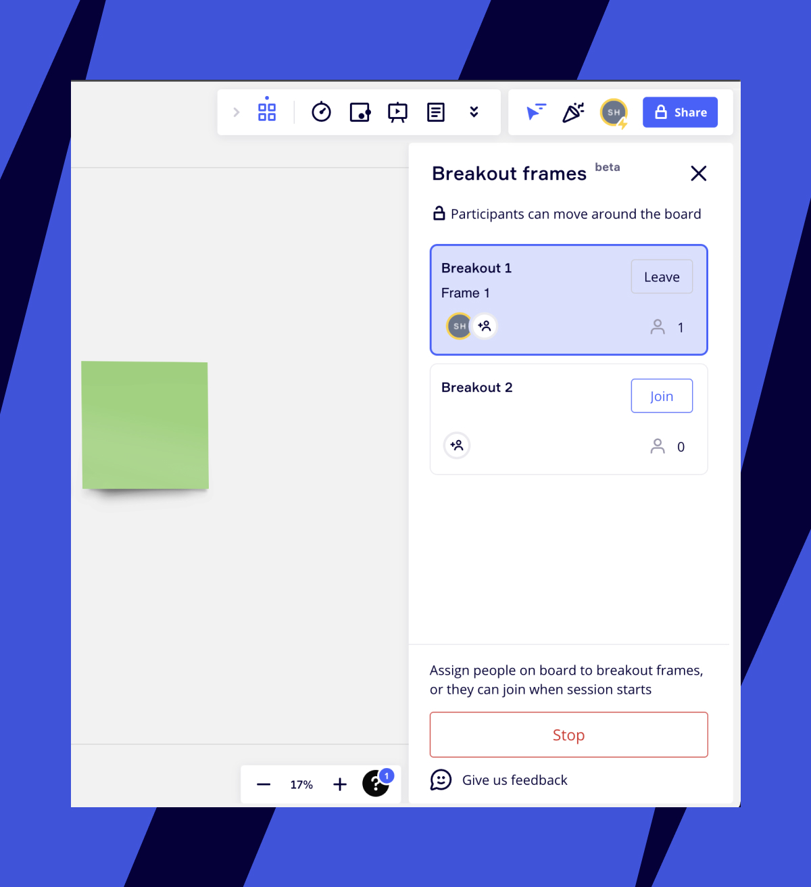

Os quadros para discussão em grupo da Miro ajudam você a preparar e realizar atividades em grupo no board. Divida os participantes em grupos menores e dê a eles uma tarefa específica para incentivar a participação. Com quadros para discussão em grupo, você pode orientá-los ao próprio espaço de colaboração virtual para criar conexões significativas.

> **Disponível para**: usuários selecionados nos planos Business, Education e Enterprise
> **Configurado por**: titulares de boards, cotitulares de boards; editores podem participar

### Como configurar Quadros para discussão em grupo

Abra discussões em grupo na barra de ferramentas de Criação.

1. Na barra de Criação, selecione **Ferramentas, mídia e integrações** (**+**).O painel **Ferramentas, mídia e integrações** abre.
2. Na guia **Ferramentas**, pesquise e selecione Quadros para discussão em grupo.
   O painel **Quadros para discussão em grupo** abre.

Você pode escolher um quadro no board ou clicar em **Criar quadros para discussão em grupo** e conectar quadros mais tarde.

Se você escolher um quadro, pode criar facilmente vários quadros com o mesmo conteúdo: escolha um quadro no board, escolha o número de quadros no menu suspenso e pressione o botão azul **Criar quadros para discussão em grupo**. Os quadros com o mesmo conteúdo aparecerão no board ao lado do quadro original e serão automaticamente ligados aos quadros para discussões em grupo.

Você pode conectar quadros às discussões em grupo, desconectar e atribuir participantes a cada quadro de discussão em grupo no painel de Quadros para discussão em grupo. Você pode atribuir um usuário a apenas uma discussão em grupo. Observe que você só pode atribuir usuários que estão no momento **online no board**.

Sinta-se à vontade para renomear quadros para discussão em grupo, excluir alguns e adicionar novas discussões em grupo. Para adicionar um novo quadro para discussão em grupo, clique no botão de adição. O número máximo de quadros para discussão em grupo que você pode criar em uma única sessão de quadros para discussão em grupo é de **100**. Ao atingir o limite, a capacidade de criar novos quadros para discussão em grupo será desativada e uma dica de ferramenta será exibida ao passar o mouse.

*Como renomear um quadro e adicionar um novo quadro*

A opção **Bloquear participantes no quadro vinculado** está desabilitada por padrão. Quando habilitada, impede que os participantes naveguem para outros quadros depois de entrar em uma discussão em grupo. Quando desabilitada, os participantes podem se mover livremente para outros quadros no board durante a sessão de discussão em grupo.

Clique em **Iniciar** para iniciar a sessão.

> **✏️** Observe que esses quadros para discussão em grupo da Miro ainda não estão conectados às discussões em grupo por videoconferência e isso é algo que analisaremos no futuro.Saiba como você pode usar os quadros para discussão em grupo da Miro com o Zoom.

### Como funciona para os participantes do board

Depois de iniciar uma sessão de discussão em grupo, os participantes do board poderão visualizar o painel no lado direito do board. Usuários atribuídos são redirecionados para seus quadros. Outros usuários podem participar de qualquer quadro para discussão em grupo desejado.

Os participantes podem sair de seus quadros e participar de outros quadros para discussão em grupo durante a sessão.

*Como sair e entrar em discussões em grupo*

> **✏️**Se a visualização dos participantes estiver bloqueada para quadros nas discussões em grupo, eles não poderão sair do quadro, a menos que *saiam do quadro para discussão em grupo ao qual o quadro está conectado.*

Durante a sessão, o facilitador pode visualizar o número de participantes e seus avatares em cada quadro e atribuir os usuários a quadros específicos. Para parar a sessão e fazer com que os participantes saiam dos quadros para discussão em grupo, clique no botão correspondente.

*Como uma sessão de discussão em grupo parece para o facilitador*

### Como usar quadros para discussão em grupo em apresentações

Adicione a atividade de quadros para discussão em grupo a slides específicos da sua reunião ou apresentação na Miro e salve-a com antecedência.

### Como salvar quadros para discussão em grupo como template

Se você salvar seu board como template, os quadros para discussão em grupo no board serão salvos automaticamente com o template também. Você pode usar o [template personalizado](../../getting-started/start-here/your-first-board/04-templates.md) mais tarde para criar a mesma experiência de discussão em grupo para os participantes do board.

### Como usar os quadros para discussão em grupo da Miro e as salas para discussão em grupo do Zoom juntos

Você pode usar as discussões em grupo da Miro e as discussões em grupo do Zoom juntos para acelerar o processo de tomada de decisão no seu time.

1. Na Miro, prepare o conteúdo de quadros para discussão em grupo e vincule as discussões em grupo aos quadros.
2. Inicie discussões em grupo no Zoom e atribua seus participantes às salas.
3. Certifique-se de ter o mesmo número de salas no Zoom e na Miro. Você pode adicionar e excluir quadros facilmente na Miro se necessário.
4. Inicie discussões em grupo na Miro e peça aos participantes para se juntarem à mesma sala à qual foram atribuídos no Zoom. Isso evitará que você tenha que atribuir manualmente cada pessoa em ambos os aplicativos. Você ainda pode observar todas as discussões em grupo e ajustar as atribuições por conta própria, caso alguns usuários precisem de orientação.

:::tip
Saiba como você pode colaborar nos boards da Miro dentro das reuniões do Zoom com o [aplicativo da Miro para o Zoom](../../integrations-apps/zoom/02-miro-app-for-zoom-user-guide.md).
:::
