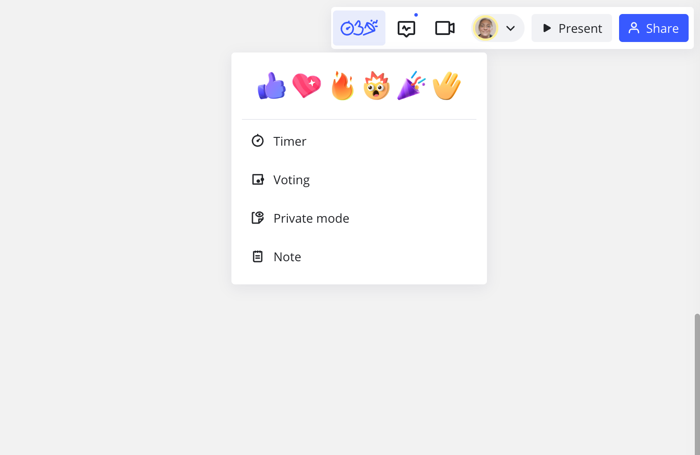

Com as **reações** do momento você pode *demonstrar*, em vez *de dizer*.

Você pode selecionar entre seis emojis para expressar como se sente em um determinado momento durante reuniões e workshops. Os participantes também terão a opção de levantar a mão e os facilitadores serão notificados.

> **Disponível em:**versão para navegador,[aplicativo para desktop](../../getting-started/apps-for-devices/05-desktop-app.md), [aplicativo para tablet](../../getting-started/apps-for-devices/11-tablet-app.md)

### Como usar reações

> **Configurado por:** editores do board

Você pode encontrar o recurso de reações no canto superior direito do board, à esquerda do seu avatar, nas **ferramentas de facilitação e no ícone Reações** .

A qualquer momento, você pode usar reações para expressar como se sente seguindo estes passos:

1. Clique no ícone **Ferramentas de facilitação e reações** no canto superior direito.
2. Clique em um dos seis emojis que melhor descreve como você se sente naquele momento.
3. O emoji aparecerá no board junto com seu avatar.

*Usando reações no board*
