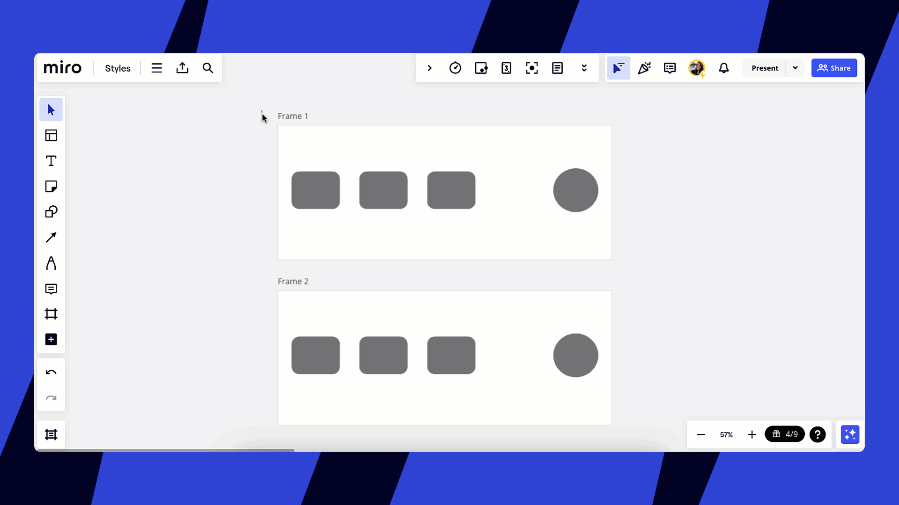
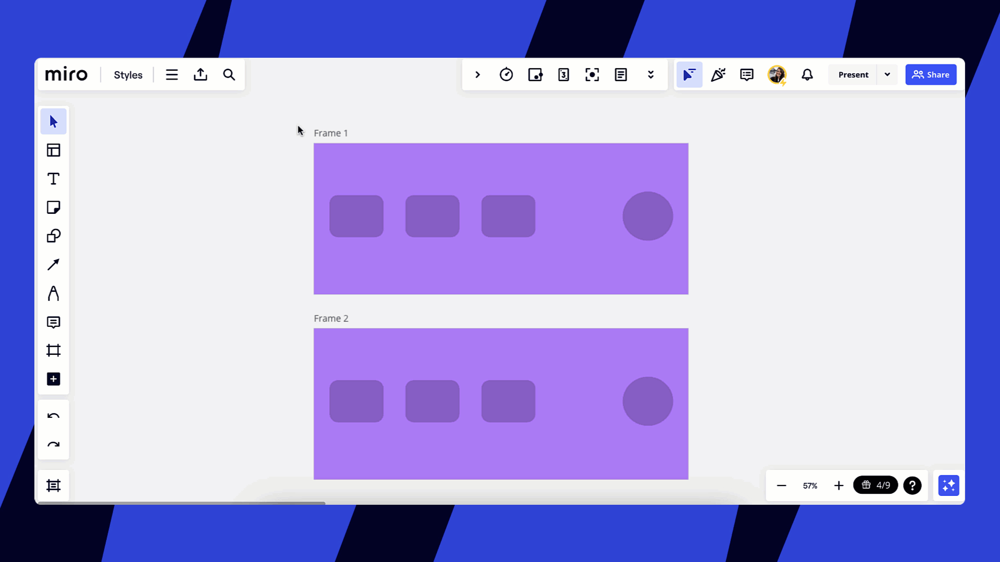
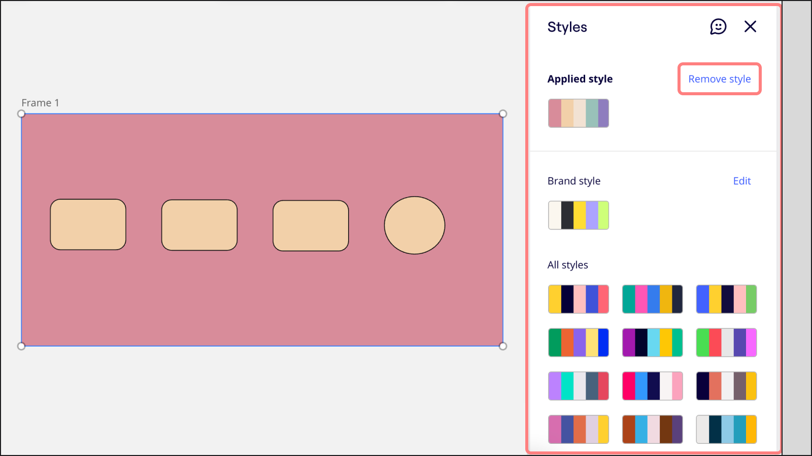

Com os estilos, qualquer pessoa pode criar apresentações e boards visualmente atraentes, com uma aparência profissional. Escolha entre 14 paletas de cores com várias variações.

- Estilize boards inteiros sem esforço
- Crie trabalhos refinados para suas audiências
- Reduza o tempo gasto na formatação

> **Disponível para:** planos Free, Starter, Business, Enterprise e Education

## Usando estilos

### Como aplicar estilos a quadros

1. Selecione um quadro ou vários quadros no board.
2. O menu de contexto será aberto.
3. Clique no ícone de **estilos**.
4. O painel de estilos será aberto.
5. Selecione um dos estilos padrão ou um [estilo personalizado da marca](../../administration/get-started-as-a-miro-admin/04-brand-center.md)**.**
6. O estilo será aplicado ao quadro e a todos os objetos dentro do quadro.

*Aplicando um estilo aos quadros selecionados*

### Aplicar diferentes variações de estilo

Explore várias variações de um estilo. Abra o painel de **Estilos** novamente e, ao lado de **Recentes**, passe o mouse sobre o estilo e clique em **Embaralhar.** As cores do estilo aparecerão em uma nova ordem.

*Aplicando diferentes variações de estilo*

:::note
Para garantir que nosso conteúdo seja acessível e inclusivo para todos, algumas cores da marca podem ser ajustadas. Estas mudanças estão alinhadas com os padrões de acessibilidade, pois priorizamos a usabilidade para oferecer uma experiência ideal para todos os usuários.
:::

## Redefinindo um estilo

Desfaça facilmente qualquer alteração indesejada e restaure o estilo original do seu board. Basta abrir o painel de **Estilos** e, ao lado de **Estilo aplicado**, clicar em **Remover estilo.**

*A opção para remover um estilo previamente aplicado*
