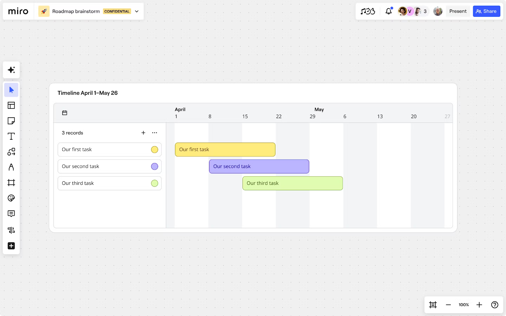
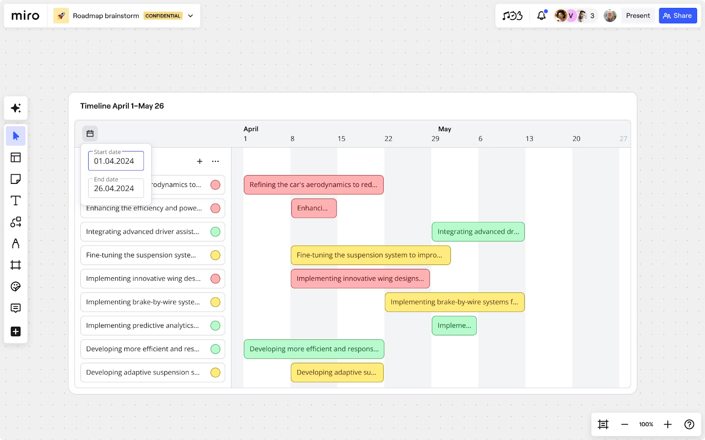
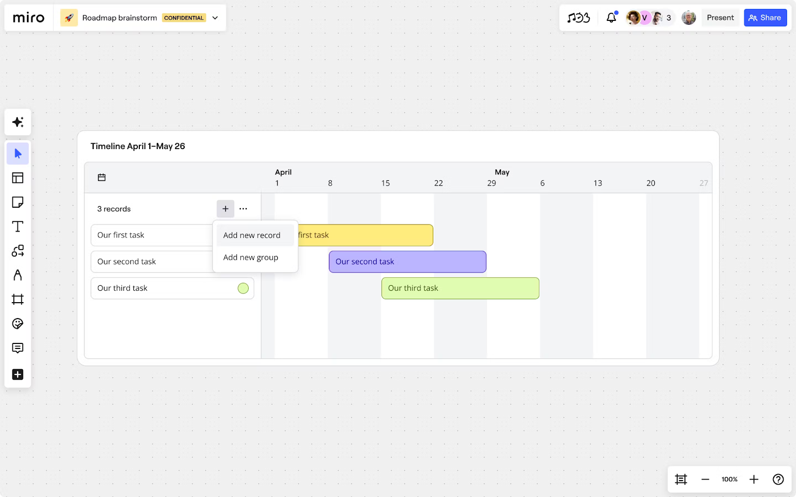

O Timeline é uma ferramenta de planejamento interativa que alinha estrategicamente as partes interessadas e os times. Use o Timeline para fazer um roadmap do seu projeto, adicionar visibilidade e atingir marcos de forma mais eficiente. Crie, gerencie e compartilhe seu cronograma diretamente de um board da Miro.

O Timeline visualiza seu projeto como tarefas, chamadas de registros, e barras de tempo. Cada registro representa uma tarefa e a barra de tempo mostra nitidamente o tempo esperado para concluir essa tarefa. O widget Timeline também permite que vários usuários interajam com o Timeline simultaneamente.

Crie grupos para ordenar registros logicamente e mover registros entre grupos. Por exemplo, você pode ordenar seu projeto por marco.

O widget Timeline também interage com [os Cartões da Miro](../essential-tools/02-cards.md).

*O widget Timeline em ação*

:::note
O Timeline está na versão beta. Algumas funcionalidades descritas ou mostradas estão sujeitas a alterações, ou podem estar indisponíveis até o lançamento do GA ainda este ano. Não deixe de conferir este artigo para obter atualizações, já que o Timeline continua a evoluir.
:::

## Principais funcionalidades

- **Personalize uma Timeline interativa** em qualquer lugar no seu board da Miro.
- **Adicione e exclua registros** dentro do widget Timeline.
- **Arraste e solte cartões da Miro, cartões do Jira e cartões do Azure** no widget Timeline.*
- **Crie grupos de registros** para organizar as informações logicamente.
- **Redimensione cada barra de tempo** para alterar as datas de registros individuais.
- **Dimensione a visualização da Timeline e as barras de tempo** automaticamente ao ajustar as datas.
- **Inclua vários widgets Timeline** com diferentes fontes de dados no mesmo board da Miro.
- **Compartilhe sua Timeline** com membros do time e partes interessadas.

## Adicione Timeline ao seu board

1. Abra um board da Miro.
2. Selecione **Mais aplicativos** (**+**) na [barra de ferramentas de criação](../../getting-started/start-here/your-first-board/05-toolbars.md).
3. Pesquise e selecione **Timeline**.
   Seu cursor agora aparece como o ícone da Timeline.
4. Selecione qualquer lugar no board da Miro para colocar seu widget Timeline.

*Como colocar o widget Timeline*

*Na versão beta, a interação do widget Timeline com os cartões do Jira é limitada. A interação com os cartões do Azure não está disponível.

## Interações da Timeline

O widget Timeline fornece vários controles que permitem que você gerencie seu planejador.

### Adicionar um registro

Selecione o sinal de adição (**+**) acima da coluna de registros. O Timeline mostra um novo registro.

Para reposicionar um registro, arraste e solte o registro para cima ou para baixo no planner. Você pode arrastar e soltar opcionalmente a barra de tempo correspondente.

### Editar texto de registro

Selecione o registro ou a barra de tempo e, então, selecione o texto. O cursor piscando indica que o texto está pronto para edição.

### Excluir um registro

1. Selecione um registro ou barra de tempo para edição.
2. Exclua o texto.
   Uma caixa de diálogo aparece abaixo da linha do tempo avisando que a exclusão é permanente.
3. Para excluir o registro, selecione **Excluir mesmo assim**.

:::warning
Na versão beta, desfazer não está disponível.
:::

### Alterar as datas de início e término

Selecione o botão do calendário dentro do widget Timeline e escolha as datas de início e término.

O planner é dimensionado automaticamente para corresponder à sua seleção.

Para alterar as datas de início e término de um registro específico, selecione e arraste qualquer extremidade da barra de tempo.

*Como alterar as datas de início e término no widget Timeline*

### Alterar a cor do registro

Selecione o círculo de cores na coluna de registros e, em seguida, selecione uma cor.

A cor da barra tempo e registro muda para corresponder à sua seleção.

### Reposicionar registros

Na coluna de registros, arraste e solte um registro para reposicioná-lo no planner. Você pode arrastar e soltar uma barra de tempo.

### Criar um grupo de registros

Um grupo permite que você organize seus registros logicamente. Por exemplo, você deseja ordenar um roadmap por marco.

Para criar um grupo, selecione os três pontos (**...**) acima da coluna de registros e, em seguida, selecione **Adicionar novo grupo**.

*Como adicionar um novo registro no widget Timeline*

**DICA:** Você pode arrastar e soltar um registro para outro grupo.

### Excluir um grupo de registros

Selecione os três pontos (**...**) acima da coluna de registros e, em seguida, selecione **Excluir grupo**.

## Adicione cartões à sua linha do tempo

O widget Timeline visualiza os dados dos cartões da Miro, cartões do Jira e cartões do Azure.

No seu board da Miro, basta arrastar e soltar qualquer cartão em um widget Timeline.

&lt;screenshot&gt;

:::warning
Na versão beta, a interação do widget Timeline com os cartões do Jira é limitada. A interação com os cartões do Azure não está disponível.
:::

## Compartilhe sua linha do tempo

No seu board da Miro, siga estas etapas:

1. Selecione o widget Timeline que você deseja compartilhar.
   O menu de contexto aparece acima do widget.
2. Selecione o menu **mais** (**...**).
   Um menu suspenso abre.
3. Selecione **Copiar link**.
4. Compartilhe o link com qualquer pessoa que tenha permissão para visualizar o board.
