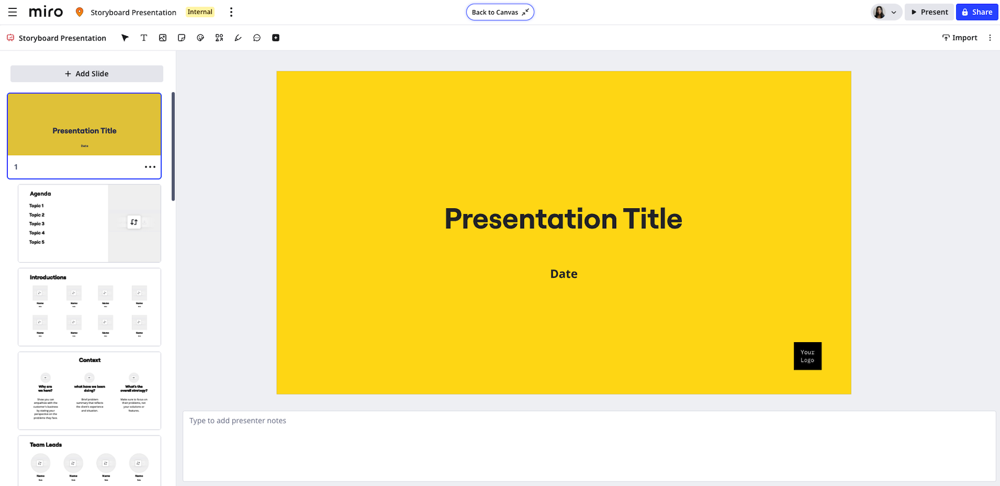
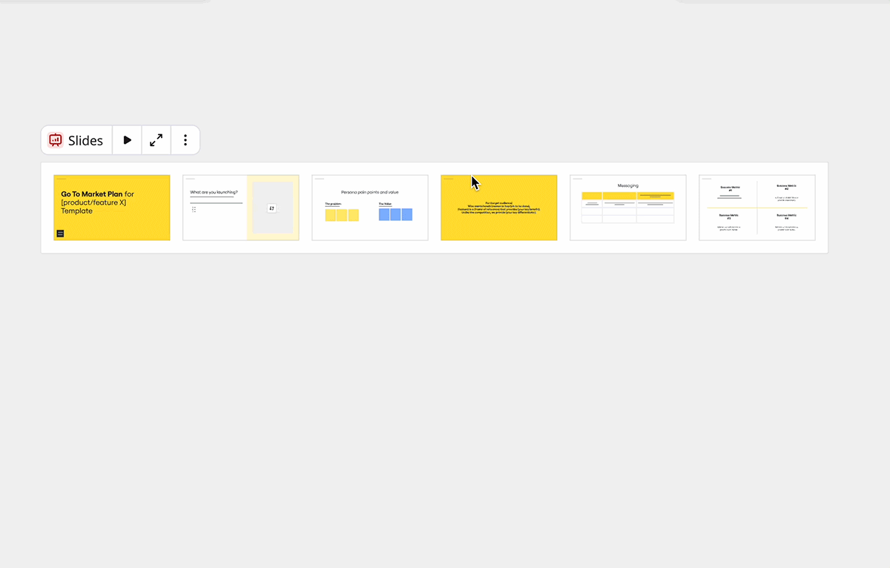

Com os Slides da Miro, você pode criar apresentações interativas e dinâmicas diretamente na Miro. Apresente seus slides colaborando em times, fazendo anotações e brainstormings em tempo real.

*Com os Slides da Miro, é possível criar e participar de uma apresentação de slides bem estruturada.*

## Descrição da funcionalidade

Ao combinar uma tela interativa com um deck de slides estruturado, os Slides da Miro ajudam os times a compartilhar e apresentar com mais eficiência.

A funcionalidade Slides da Miro é ideal para reuniões de times e workshops que precisam de um deck de slides dinâmico e interativo.

### Gerenciamento e apresentação de slides sem complicação

Os slides podem incluir vários tipos de conteúdo, por exemplo, texto, notas adesivas e vídeos. Também é possível adicionar formatos, como diagramas e tabelas. Você pode arrastar e soltar o conteúdo do seu board da Miro nos seus slides. Aplique estilos a toda a apresentação e arraste os slides no seu board para reorganizar seu conteúdo.

Você também pode selecionar quadros existentes no seu board para transformar outros conteúdos em slides.

A funcionalidade Slides da Miro inclui **modo foco** para criar e editar um slide de cada vez. Adicione as notas da apresentação, importe e reorganize seus slides no **modo foco**.

*Reordene seus Slides e adicione notas do apresentador no **modo foco**.*

Você pode iniciar sua apresentação no modo foco, selecionar **Apresentar** e a apresentação começa no slide atual, ou diretamente do board.

:::note
No aplicativo móvel da Miro, o modo foco não está disponível para Slides.
:::

## Como usar os Slides da Miro

Esta seção descreve como criar, gerenciar e apresentar os Slides da Miro.

### Crie Slides na Miro

Para criar um slide, faça uma das seguintes opções:

- Em um board da Miro, na barra de criação, selecione (**+**) **Ferramentas, mídia e integrações**  > **Slides**.
- Em um board da Miro, selecione um ou vários quadros. No menu de contexto, selecione **Transformar em slides**.
- Na barra lateral de Espaços, selecione (**+**) **Criar novo**  > **Slides**.
- No seu painel da Miro, selecione **+ Criar novo** > **Slides**.

Para adicionar um slide à sua apresentação, selecione o botão de mais (**+**) ao lado de qualquer slide. Também é possível arrastar um quadro de qualquer lugar do seu board para o deck.

:::tip
Você também pode adicionar um slide do menu de contexto de Slides. Selecione os três pontos verticais e depois selecione **Adicionar novo quadro**. Para mais informações sobre o menu de contexto, confira Como gerenciar slides.
:::

### Compartilhar um deck de slides (Beta)

Você pode copiar um link exclusivo para compartilhar seu deck de slides com membros do time ou stakeholders externos sem uma conta Miro.

1. No menu de contexto do Slides, clique nos três pontos verticais para abrir o menu **Mais**.
2. Clique em **Compartilhar e exportar** > **Compartilhar apresentação**.
   A janela **Compartilhar apresentação** será aberta.
3. Clique em **Copiar link**.
4. (Opcional) Clique em **Pré-visualizar no navegador** para ver como qualquer pessoa com seu link visualiza seu deck de slides.
5. Compartilhe seu link.

> **NOTA:** Para que usuários externos acessem, o seu board deve estar público. Usuários externos só poderão visualizar o deck de slides no modo de apresentação e nenhum outro conteúdo do canvas. Se as permissões do board permitirem, usuários externos também podem comentar.

> **DICA:** Você também pode copiar um link compartilhável no modo foco. No canto superior direito, clique nos três pontos verticais para abrir o menu **Mais**. Em seguida, clique em **Compartilhar apresentação**.

### Importar arquivos PDF para os Slides da Miro

Importe um deck de apresentação de outra ferramenta para os Slides da Miro.

Certifique-se de exportar seu deck da outra ferramenta como um arquivo PDF.

Siga estes passos a partir do canvas:

1. Para importar o PDF para os Slides da Miro, siga uma das opções abaixo:
   - **Arrastar e soltar**
     Arraste o arquivo PDF para o board da Miro.
   - **Carregar**
     Na barra de criação, selecione **Ferramentas, mídia e integrações**. Em seguida, pesquise e selecione a ferramenta **Carregar**. Selecione **Meu dispositivo**, vá até seu arquivo PDF e conclua o carregamento.
2. No seu board, selecione o PDF.
3. No menu de contexto, selecione **Transformar em slides**.

:::tip
Você também pode importar no modo foco. Crie slides e, no menu de contexto, abra o modo foco. No canto superior direito, clique no botão **Importar**.
:::

### Exportar Slides da Miro para PDF

Para exportar os Slides da Miro para PDF, selecione sua apresentação para acessar o menu de contexto. Clique nos três pontos verticais e depois selecione **Compartilhar e exportar** > **Exportar como PDF**.

Escolha a qualidade da exportação e, em seguida, selecione **Exportar**.

:::tip
Você também pode exportar no modo foco. No canto superior direito, clique no **ícone dos três pontos verticais** () e depois selecione **Exportar como PDF**.
:::

### Exportar slides como imagem

Você pode exportar um slide do seu deck de Slides da Miro como JPG, PDF ou SVG. Por exemplo, se você quiser incorporar o slide em outro documento.

Para exportar um slide como imagem, siga estas etapas:

1. Do seu deck de slides, selecione um slide.
   O menu de contexto do slide aparece.
2. No menu de contexto, clique nos três pontos verticais para abrir o menu **Mais**.
3. Clique em **Compartilhar e exportar** > **Exportar como imagem**.
   O modal **Exportar imagem como** se abre, e a janela de seleção contém seu slide.
4. No modal **Exportar imagem como**, selecione se deseja exportar como JPG, PDF ou SVG.
   Para JPG, você pode opcionalmente especificar a resolução como **Pequena**, (Padrão) **Média** ou **Grande**.
5. Clique em **Exportar**.

### Importar arquivos PowerPoint para os Slides da Miro

Você pode importar um arquivo PowerPoint (.PPTX) e converter sua apresentação em Slides da Miro totalmente editáveis. O tamanho máximo do arquivo para conversão é de 50MB.

Siga estes passos:

1. Na barra de criação, clique em (**+**) **Ferramentas, Mídia e Integrações**.
2. Clique em **Carregar**.
   Você pode opcionalmente pesquisar, ou no menu rolar até **Mídia** > **Carregar**.
   O menu de carregar é aberto.
3. Clique em **Meu dispositivo**.
   O gerenciador de arquivos do seu computador é aberto.
4. Selecione seu arquivo PowerPoint (.PPTX).
5. Clique em **Abrir**.
   A caixa de diálogo de **Opções de importação** se abre.
6. Clique em **Converter em slides**.
   O arquivo PowerPoint é carregado no seu board Miro. O tempo de carregamento pode variar dependendo do tamanho do arquivo e da resolução das imagens nele contidas.

:::tip
Como alternativa, arraste e solte seu arquivo PowerPoint (.PPTX) do seu gerenciador de arquivos diretamente no board Miro no seu navegador. A caixa de diálogo de **Opções de importação** se abre. Selecione **Converter em slides**.
:::

:::note
Nas **Opções de importação**, se você clicar em **Adicionar como arquivo**, a apresentação será carregada apenas como referência de visualização. O tamanho máximo do arquivo para adicionar como arquivo é 30MB.
:::

### Gerenciar Slides

Os Slides da Miro incluem um menu de contexto que permite gerenciar sua apresentação. Você pode iniciar sua apresentação, aplicar estilos e exportar seu deck de slides para PDF.

O menu de contexto de Slides inclui as seguintes opções:

- **Iniciar apresentação**
  Abre o modo de apresentação em tela cheia com uma barra de criação simplificada. Também inclui uma barra de ferramentas com navegação de slides, ferramentas de participação, reações e preferências. Você pode encerrar e compartilhar a apresentação.

  > 💡 Você também pode compartilhar sua apresentação dentro do aplicativo móvel da Miro. Selecione o quadro de Slides e clique na seta de reprodução na barra de ferramentas.
- **Modo Foco**
  Abre uma visualização dedicada para editar Slides. Você pode adicionar e organizar os slides. Para sair do **Modo Foco**, selecione **Ir para o canvas**.
- **Redimensionamento preciso**
  Quando estiver trabalhando no modo foco, você pode redimensionar widgets de forma precisa dentro dos seus slides usando dimensões em pixels. **Mais informações:** Veja [Redimensionamento preciso](../essential-tools/01-precise-resizing.md).
- **Apresentações multi-lane**
  Os slides podem ser organizados em múltiplas faixas dentro da mesma apresentação, permitindo uma organização e rearranjo mais fáceis dos slides individuais. Para adicionar novas faixas, passe o mouse abaixo de uma faixa existente e clique no ícone de mais, ou simplesmente arraste e solte os slides.
  *Exemplo de slides multi-lane*
- **Mais**
  Um menu vertical de três pontos que inclui estilos, exportar como PDF, duplicar, vincular e muito mais.

:::tip
Você pode copiar e compartilhar um link para seus Slides no board ou diretamente no **modo foco**. No menu **Mais**, selecione **Copiar link** ou **Copiar link do modo foco**.
:::
