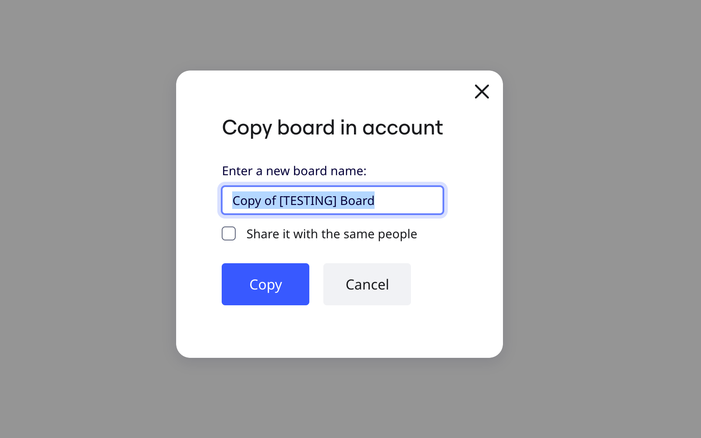

Você pode duplicar um board a partir do painel ou a partir da janela de informações do board.

> **Disponível em**: versão para navegador (desktop e tablet), aplicativo para desktop, aplicativo para tablet
> **Configurado por:** para boards no plano Free: membros do time;
> para boards nos planos Starter[,](../sharing-boards/14-how-to-allow-or-restrict-copying-and-exporting-boards-and-content.md) Business, Enterprise e Education: usuários que têm permissão para duplicar o board nas configurações de conteúdo do board

### Como duplicar um board da Miro

Para duplicar uma board de dentro da própria board :

1. Clique no **menu principal** (ícone) na barra de ferramentas superior esquerda.
2. Clique no submenu **board** .
3. Clique em **Duplicar**.
   Uma caixa de diálogo é aberta.
4. Insira o novo nome do board , selecione se deseja preservar as configurações de compartilhamento no board duplicado e clique em **Copiar**.

Como alternativa, você pode duplicar um board na caixa de diálogo de detalhes do board :

1. Clique no**menu principal** (ícone) na barra de ferramentas superior esquerda.
2. Clique no submenu **board** .
3. Clique em **Detalhes**.
   Uma caixa de diálogo é aberta.
4. Clique no botão **Duplicar** na parte inferior.
   Uma caixa de diálogo é aberta.
5. Insira o novo nome do board , selecione se deseja preservar as configurações de compartilhamento no board duplicado e clique em **Copiar**.

:::note
[Quando os usuários duplicam um board, as Talktracks também serão duplicadas para o novo board.](../facilitation-tools/asynchronous-tools/02-talktrack-board-recordings.md)
:::

> **[✏️](../sharing-boards/07-collaboration-with-guests.md)** Se você for [convidado](../../enterprise-administration/enterprise-subscription-management/enterprise-licensing/04-free-restricted-license.md) no board e não for membro de outros times da Miro ou tiver uma licença gratuita limitada, será sugerido ainda que crie um novo time da Miro para salvar a cópia do board.

Para duplicar um board do painel:

1. Passe o mouse sobre a miniatura do board.
2. Clique no ícone de menu de **três pontos** (**...**).
3. Clique em **Duplicar**.
   Uma caixa de diálogo é aberta.
4. Insira o novo nome do board , selecione se deseja preservar as configurações de compartilhamento no board duplicado e clique em **Copiar**.

:::warning
Os nomes de board têm um limite máximo de 61 caracteres. Ao duplicar boards, "Cópia de..." será adicionado ao nome do board. Se houver muitos caracteres, o board não será copiado. Reduza o nome do seu board e duplique o board novamente.
:::

*Janela para copiar o board*

## Perguntas frequentes

1. *Se eu alterar o conteúdo da cópia do board, o board original será afetado?*
   - Não, o conteúdo da cópia não tem conexão com o conteúdo do board original.
2. *Como posso duplicar o conteúdo do board para outro board existente?*
   - [Selecione o conteúdo necessário](../working-on-the-board/10-working-with-objects.md), copie e cole em outro board (você pode usar **Ctrl+C/Ctrl + V** *para Windows* ou **Cmd + C/Cmd + V** *para Mac*).
3. *Posso duplicar boards em massa?*
   - Não. No momento, não é possível.
4. *Posso compartilhar meu board como template para que outros usuários possam duplicá-lo em seus próprios times?*
   - Sim, você precisa ter certeza de que esta opção está permitida nas [configurações de conteúdo do seu board](../sharing-boards/14-how-to-allow-or-restrict-copying-and-exporting-boards-and-content.md).
