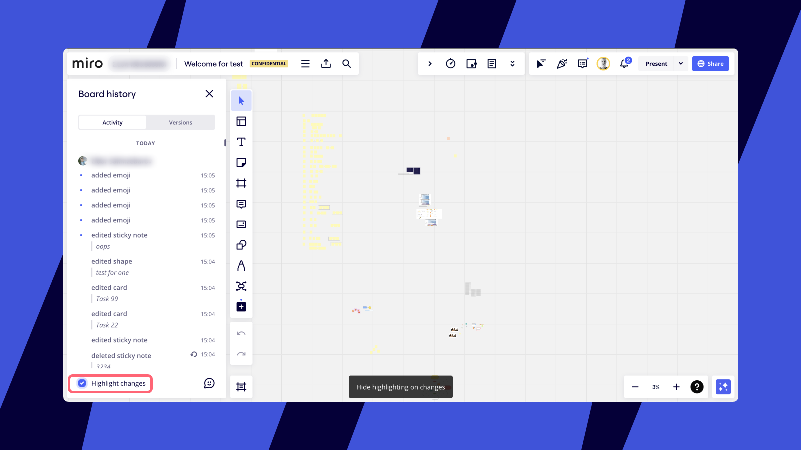
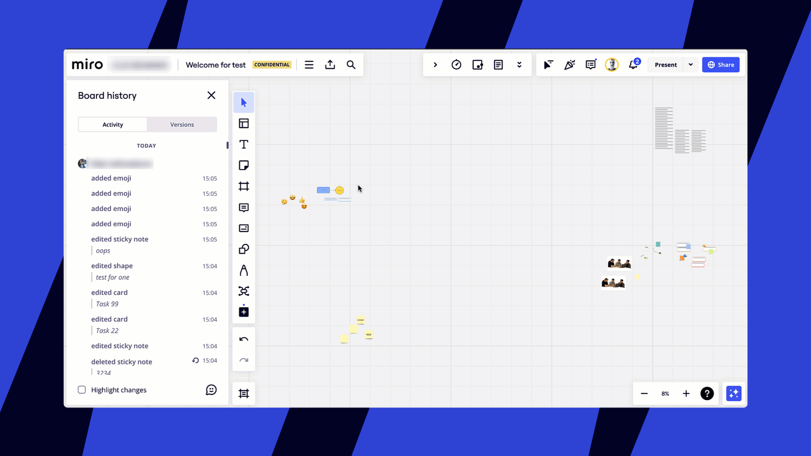

Às vezes, gerenciar o fluxo de trabalho do seu time em um único board é um pouco desafiador. Atividade é a nossa abordagem para monitorar e avaliar as contribuições que cada colega de equipe adiciona aos seus boards.

> **Disponível em**: versão para navegador, aplicativo para desktop, aplicativo para tablet
> **Configurado por:** editores que foram explicitamente convidados para os boards [por e-mail](../sharing-boards/03-sharing-boards-and-inviting-collaborators.md) ou têm acesso ao board porque fazem parte de um [espaço](../spaces/01-spaces.md) ou [time](../sharing-boards/03-sharing-boards-and-inviting-collaborators.md) no Miro

### Lista de atividades do board

Você pode acessar o log de alterações de um determinado board. Na barra do board , selecione os três pontos verticais para acessar o menu **principal** e, em seguida, selecione **board** >**Histórico**. O painel **Histórico** é aberto, mostrando a guia **Atividade** por padrão.

A **atividade** é visível para editores de boards que foram explicitamente convidados para os boards [por e-mail](../sharing-boards/03-sharing-boards-and-inviting-collaborators.md) ou têm acesso ao board porque eles fazem parte de um [projeto](../spaces/01-spaces.md) ou [time](../sharing-boards/03-sharing-boards-and-inviting-collaborators.md) da Miro (em outras palavras, é visível para os [convidados](../sharing-boards/07-collaboration-with-guests.md) e membros do time com direitos de editor no board). Se o board for compartilhado [por meio de um link com a empresa](../sharing-boards/03-sharing-boards-and-inviting-collaborators.md) ou [por um link público](../sharing-boards/03-sharing-boards-and-inviting-collaborators.md#compartilhar-boards-por-meio-de-um-link-publico) com os visitantes, a **Atividade** não será visível para eles. Os visualizadores e comentaristas não veem a **Atividade**.

Se você abrir um board que alguém editou enquanto você estava ausente, verá a opção **Destacar alterações** na parte inferior do painel Histórico do board .

Na parte inferior do painel **Atividade**, você pode habilitar e desabilitar o destaque das alterações recentes feitas por outros usuários enquanto você estava fora.  Se você habilitar o realce das alterações, haverá um redirecionamento automático para o objeto modificado mais recentemente no board.

*Mostrar destaque nas alterações*

As alterações do board são organizadas por *ordem de data* e agrupadas por usuário. Todas as alterações são registradas na hora **local** do usuário. Há três categorias de alterações que você encontrará incluídas:

- adicionar e duplicar conteúdo
- editar conteúdo
- excluir conteúdo (incluindo as ações [Desfazer](../essential-tools/16-undoredo.md))

Se você quiser definir uma ação específica, pode rolar a lista e examinar o conteúdo das edições — todas as alterações do texto são mostradas como referências abaixo do nome da ação (se for um quadro, o nome do [quadro](../essential-tools/07-frames.md) será exibido).

Ao clicar em um registro na lista, haverá o redirecionamento automático para o objeto correspondente no board e ampliará a área para visualizar a alteração em detalhes (exceto para **Excluir** registros).

*Clique em um evento para pular para um objeto atualizado*

Em busca da otimização de conteúdo em todos os aspectos, limitamos a lista a sempre exibir apenas a alteração mais recente — se você modificar um objeto várias vezes, todas as modificações anteriores serão excluídas da lista.

Independentemente do que esteja trabalhando no momento, todos os objetos do board, incluindo [comentários](../facilitation-tools/asynchronous-tools/01-comments.md) e arquivos enviados serão registrados e rastreados **em tempo real** logo após você sair do modo de edição — não há necessidade de reabrir o menu ou atualizar o board. Uma exceção é [mover objetos](../working-on-the-board/10-working-with-objects.md) — você não encontrará nenhum registro disso na lista.

Para fechar o painel **Atividade**, basta clicar no ícone da cruzno canto superior direito do painel.

Se seus colaboradores alteraram algo em um board enquanto você estava offline, você verá o botão **Ver alterações recentes** ao entrar no board.  Clique em Ver alterações recentes para ver todas as alterações destacadas em rosa no board. Você verá os nomes dos colaboradores que adicionaram/modificaram objetos no board e a hora em que as atualizações foram feitas. Para ocultar o destaque, clique em Ocultar destaque nas alterações.

Se você não clicar no botão **Ver alterações recentes** por 30 segundos, ele desaparecerá.

*Destacando mudanças no board*

:::note
A atividade do histórico do board salvo é armazenada por 90 dias.
:::

### Como restaurar conteúdo do board recentemente excluído usando a Atividade

> **Configurado por:** editores do board
> **Disponível em**: versão para navegador, aplicativo para desktop, aplicativo para tablet

> Para a opção de restaurar uma versão inteira do board do passado (uma captura), consulte [Histórico do board: versões](12-board-history-versions.md).

> **⚠️** A funcionalidade não está disponível para os [visitantes](../sharing-boards/08-collaboration-with-visitors.md).

Você pode restaurar objetos excluídos recentemente abrindo **Atividade** e clicando em **Restaurar** ao lado de widgets excluídos — os objetos excluídos reaparecerão no board (exatamente onde estavam antes de serem excluídos) e o board será ampliado nessa parte do board.

*Restaurando um objeto excluído*

O seguinte conteúdo está disponível para restauração:

- Qualquer conteúdo excluído do board durante sua sessão ativa atual e 30 minutos após o conteúdo ter sido excluído, caso a sessão tenha terminado
- Os últimos 1000 objetos excluídos do board — se a restauração ocorrer mais de 30 minutos após o conteúdo ter sido excluído
- Qualquer conteúdo excluído do board se os objetos tiverem sido selecionados e excluídos simultaneamente por um período indefinido — até os próximos 1000 objetos forem excluídos

Observe que pode haver casos extremos. Para mais detalhes, consulte [este artigo](../working-on-the-board/18-restoring-board-content.md).

### Perguntas frequentes

1. *Posso ver o histórico de atividades de um objeto específico?*
   - Não, mas se você clicar no objeto e escolher **Informações** nos três pontos no menu de contexto, verá quem e quando criou o objeto e o modificou pela última vez.
2. *Posso limpar a atividade?
   - Não. No momento, não é possível.*
3. *Meus boards não são compartilhados publicamente na Miro, mas vejo visitantes na Atividade.*  Por quê?
   Por quê?/em>— Isso acontece quando um board é incorporado em outro serviço (por exemplo, **Zoom**) com um Qualquer pessoa pode editar. Opção Não é necessário iniciar uma sessão.
4. *Não vejo o ícone do histórico do board na minha barra de ferramentas.*  Por quê?
   - Observe que o histórico do board só é visível para editores de boards que foram explicitamente convidados para os boards [por e-mail](../sharing-boards/03-sharing-boards-and-inviting-collaborators.md) ou que têm acesso ao board porque fazem parte de um espaço ou [time](../sharing-boards/03-sharing-boards-and-inviting-collaborators.md) no Miro. O histórico do board não é visível para os visualizadores, comentaristas ou visitantes.
5. *Não vejo o botão Ver alterações recentes.*  Por quê?
   Por quê?— O botão só é mostrado se alguém editou conteúdo enquanto você não estava presente no board. Se não houver alterações desde sua última visita, o botão não estará disponível.
