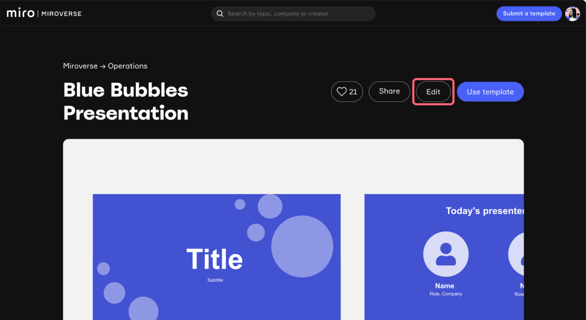
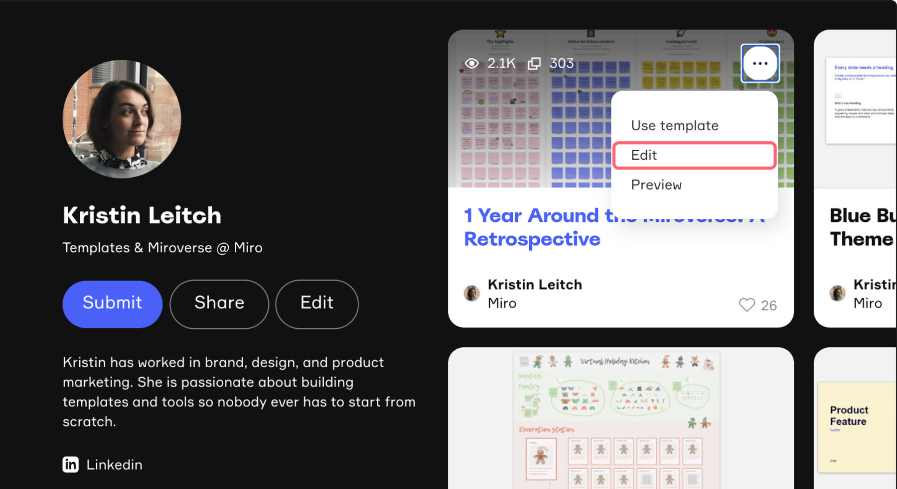
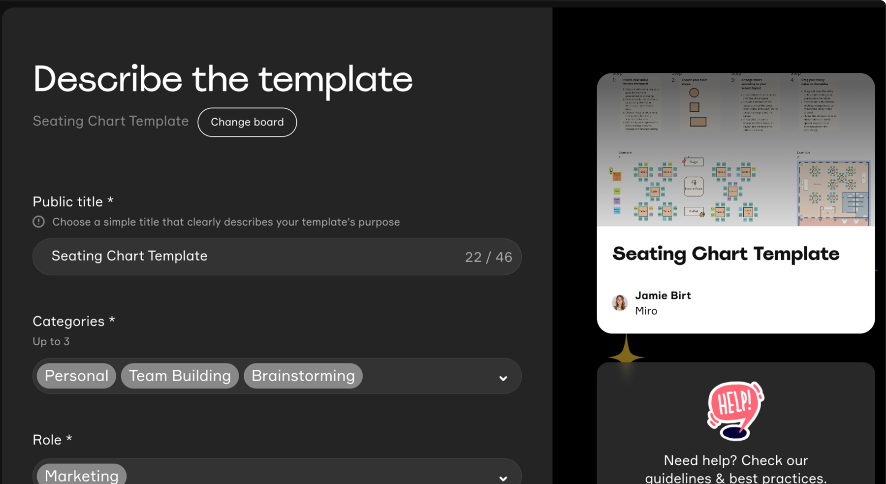

Você pode editar um template a qualquer momento, incluindo o nome do template, categorias, descrição, links de vídeo, imagem da capa e board.

O vídeo a seguir fornece um passo a passo do processo de edição.

<iframe allow="accelerometer; autoplay; clipboard-write; encrypted-media; gyroscope; picture-in-picture; web-share" allowfullscreen="allowfullscreen" frameborder="0" height="315" src="https://www.youtube.com/embed/VmYpntqM_Y0?si=6fGKiMCgzwNHfF1n" title="YouTube video player" width="560"></iframe>

## Entrar no modo de edição

Você pode entrar no modo de edição de duas maneiras:

1. Navegue até o seu template e selecione **Editar** no canto superior direito da página, logo acima da pré-visualização.

   

   *Entrando no modo de edição de template*
2. Como alternativa, entre no modo de edição para um template publicado diretamente do seu perfil no Miroverse.

   

   *Entrando no modo de edição de template a partir do seu perfil do Miroverse*

## Atualizar o conteúdo do template

Na página de edição do template, você pode alterar o board usado para o template e atualizar seus detalhes.

*Formulário de edição de template*

### Mudar o board do template

Quando você envia um template para o Miroverse, uma cópia do seu board original é criada, tornando-se a versão ao vivo. Para alterar o conteúdo do board no seu template:

1. Primeiro, edite seu board na Miro.
2. Depois de fazer os edições necessárias, volte ao seu template no Miroverse e clique em **Editar**.
3. Escolha **Alterar board** na parte superior do formulário.
4. Selecione seu board atualizado.

### Alterar detalhes do template

A partir deste formulário de edição, você também pode alterar o seu template:

- Nome
- Categorias
- Descrição
- Links de vídeo
- Imagem de capa

## Publique suas alterações

Quando terminar de atualizar seu template, você deve publicar as alterações para disponibilizá-las no Miroverse.

1. Quando estiver satisfeito com as edições, visualize-as.
2. Selecione **Publicar** para colocá-los no ar.

Depois de clicar em **Publicar**, você receberá uma confirmação via e-mail e suas atualizações serão refletidas no seu template em poucos minutos.

## Fale conosco

Se tiver alguma dúvida, não hesite em entrar em contato com o nosso time em [miroverse@miro.com](mailto:%20miroverse@miro.com).
