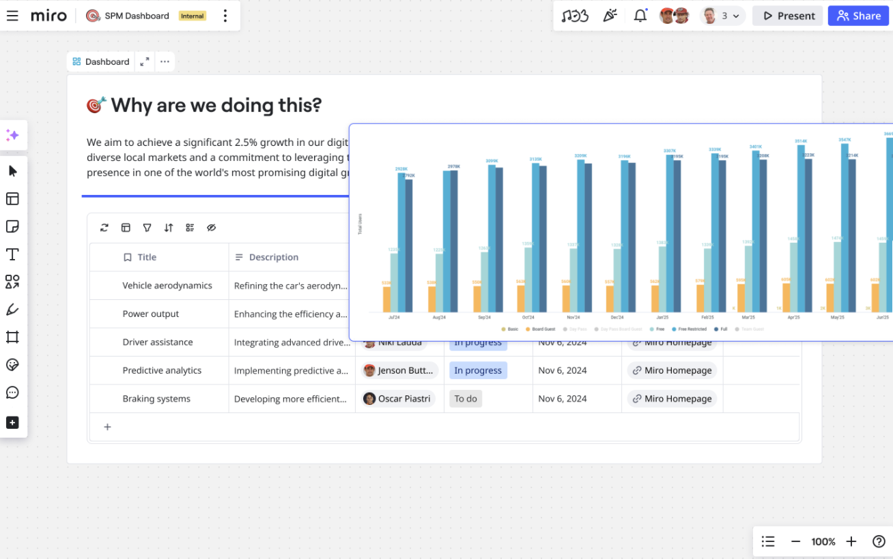

Em um Espaço, você pode designar qualquer board para atuar como a Visão geral do Espaço. Esse board se torna o ponto inicial padrão para quem acessa o Espaço, fornecendo contexto e clareza. A Visão geral do Espaço garante que os times permaneçam alinhados e transforma seu Espaço em um espaço de trabalho inteligente e dinâmico.

Este artigo descreve a funcionalidade Visão geral do Espaço e como criar uma Visão geral do Espaço. Para saber mais sobre os Espaços, veja [Espaços](01-spaces.md).

*Acesse a Visão geral do Espaço na barra lateral do Espaço.*

## Principais funcionalidades

- **Organização aprimorada**
  Use uma Visão geral do Espaço como uma central para todas as atividades e recursos do Espaço. Você pode atualizar regularmente a Visão geral do Espaço para stakeholders.
- **Visibilidade**
  A Visão geral do Espaço é visível para todos os membros do Espaço e acessível no topo da barra lateral do Espaço. A Visão geral é um ponto de referência essencial durante e entre as reuniões.
- **Comunicação e alinhamento de equipe aprimorados**
  Links para boards específicos, decisões e recursos dentro do Espaço.

## Criar uma Visão geral do Espaço

1. Abra um Espaço onde você seja titular ou cotitular.
   A visualização do Espaço é aberta.
2. Para o board que você quer definir como Visão geral do Espaço, clique nos três pontos (**...**).
3. Clique em **Definir como** > **Visão geral**.
   O board Visão geral do Espaço mantém seu nome e é posicionado no topo da barra lateral do Espaço.

:::tip
Você também pode abrir um board dentro do seu Espaço e, na barra lateral do Espaço, clicar nos três pontos (**...**) para o board que deseja designar como Visão geral do Espaço.
:::

*Você pode opcionalmente definir um board como Visão geral do Espaço a partir da barra lateral do Espaço.*

## Remover uma Visão geral do Espaço

1. Abra o Espaço onde você é titular ou cotitular.
2. Na barra lateral do Espaço, na **Visão geral**, clique nos três pontos (**...**).
3. Clique em **Remover da visão geral**.
   A Visão geral do Espaço removida retorna ao nível do Espaço e o ícone volta ao original.

:::note
Se o board definido como Visão geral do Espaço for movido para a lixeira ou para fora do Espaço, ele será automaticamente excluído da Visão geral do Espaço.
:::
