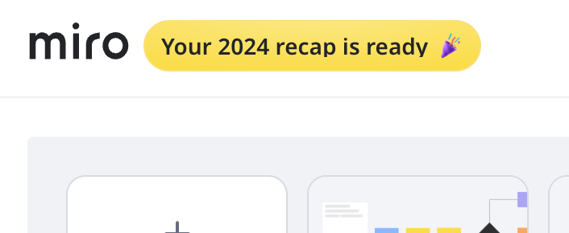

O programa de indicação da Miro permite que usuários existentes ganhem dinheiro ao indicar novas empresas para a Miro. Este programa de partilha de receitas oferece pagamentos de até USD 500 por indicação bem-sucedida.

## Como funciona o programa de indicação

**Para Você (Referência):**

- Receba 10% dos pagamentos mensais da conta indicada para cada nova empresa que se inscrever com seu código de indicação, até USD 500 por indicação.

**Para a conta referida (Convidado):**

- Os convidados recebem um desconto de 10% na sua assinatura por 11 meses consecutivos.
- Os convidados precisarão aplicar o código promocional durante a criação da conta em um plano pago para obter o desconto.

## Programa de indicação

1. Clique no ícone do **Programa de Indicação** no canto superior direito do seu painel.
2. Clique em **Copiar link de convite**.
   
   *Copiar o link do convite para enviar aos seus potenciais indicados*
3. Envie o link para contatos em outras empresas por e-mail, redes sociais ou aplicativos de mensagens.

### Recebendo pagamento pelas suas indicações

Antes de poder receber pagamentos por suas indicações, você precisará adicionar seus dados de pagamento.

1. Clique no ícone do **Programa de Indicação** no canto superior direito do seu painel.
2. Clique na guia **Recompensas**.
3. Clique em **Adicionar dados de pagamento**.
4. Selecione seu país/região de pagamento no menu suspenso.
5. Selecione sua forma de pagamento preferida entre as opções disponíveis.
6. Digite seus dados de pagamento.
7. Concordo com os Termos de Uso da Cello.
8. Clique em **Salvar forma de pagamento**.
   .png)
   *Configure suas informações de pagamento para habilitar o pagamento para suas indicações*

:::note
Você pode atualizar seu método de pagamento a qualquer momento clicando no botão **Atualizar dados de pagamento** na guia **Recompensas**.
:::

### Acompanhando suas indicações

Você pode visualizar suas indicações no **painel do Programa de Indicação**.

1. Clique no ícone **Programa de Indicação** no canto superior direito do seu painel.
2. Clique na guia **Recompensas**.
3. Você verá um resumo do total de suas recompensas no topo, juntamente com uma lista de quaisquer indicações ativas e o valor de seus pagamentos.
   .png)
   *Os ganhos do programa de indicação serão mostrados na guia Recompensas*

## Políticas do programa

- **Critérios de Elegibilidade:**
  - Os convidados devem ser novas empresas registrando-se com um e-mail de trabalho.
  - Os convidados devem aplicar o código promocional antes que ele expire.
  - Indicações para colegas dentro da própria empresa (mesmo domínio de e-mail) não são elegíveis.
- **Detalhes do código promocional:**
  - Os códigos promocionais expiram 60 dias após a emissão.
  - Códigos promocionais devem ser aplicados durante o check-out para qualquer plano pago.
  - Acumule pagamentos de indicação até um total de USD 500,00.
  - O desconto do convidado é ativo por 11 meses após a criação da conta.
- **Modificações no programa:**
  - Reservamo-nos o direito de modificar ou encerrar o programa de indicação a qualquer momento.
  - As alterações serão comunicadas por e-mail ou publicadas em nosso site.
- **Prevenção de Abuso:**
  - Qualquer atividade fraudulenta ou uso indevido resultará na desqualificação do programa.
- **Disponibilidade regional:**
  - O programa de indicação está disponível nos seguintes países: Áustria, Bélgica, Brasil, Canadá, Tchéquia, Dinamarca, Finlândia, França, Alemanha, Grécia, Hungria, Irlanda, Itália, Índia, Países Baixos, Noruega, Polônia, Filipinas, Portugal, Romênia, Espanha, Suécia, Suíça, Reino Unido, Estados Unidos.

## Perguntas frequentes

**Existe um limite para o número de empresas que posso indicar?**

Não há limite para o número de empresas que você pode indicar. No entanto, o desconto máximo que você pode ganhar é de USD 500 por indicação.

**E se o contato esquecer de aplicar o código promocional?**

O código promocional é essencial para o desconto do convidado e o pagamento do referenciador. Lembre-os de aplicá-lo diretamente ao criar conta ou dentro dos primeiros 60 dias após enviar o código.

**Por quanto tempo o código promocional é válido?**

O código promocional expira 60 dias após ser emitido. Certifique-se de que seu contato utilize dentro deste período.

**Posso indicar alguém da mesma empresa?**

Não, as referências devem ser de empresas diferentes. Os convidados devem usar um e-mail profissional com um domínio diferente do seu para se qualificar.

**Como faço para acompanhar meus descontos ganhos?**

Clique no ícone do Programa de Indicação no painel da Miro em sua conta para visualizar as indicações bem-sucedidas e os pagamentos acumulados.

**Receberei alguma notificação quando uma empresa indicada usar meu link de indicação e código promocional?**

Sim, você receberá uma notificação no painel do Programa de Indicação assim que a empresa indicada se cadastrar com sucesso e aplicar o código promocional.

**O que acontece se o código promocional expirar antes de ser usado?**

Se o código promocional expirar, o convidado não receberá o desconto. Eles precisariam de um novo link de referência e um código promocional para participar.

**A minha recompensa muda se a empresa referida cancelar a assinatura?**

Se a conta cancelar uma assinatura, os pagamentos mensais recebidos por essa indicação serão interrompidos.

**O que devo fazer se eu encontrar problemas com o meu desconto de indicação?**

Fale com o nosso suporte ao cliente para obter assistência.

**Posso indicar vários contatos na mesma conta da empresa?**

As indicações devem ser para novas contas. Vários contatos dentro da mesma conta contarão como uma única indicação.

**O que devo fazer se não recebi meu prêmio de indicação?**

Se você acredita que deveria ter recebido uma recompensa, mas ela não foi aplicada, entre em contato com nosso time de suporte ao cliente para obter assistência. Espera-se que o primeiro pagamento seja recebido pelo menos um mês após o registro de uma nova conta paga.
