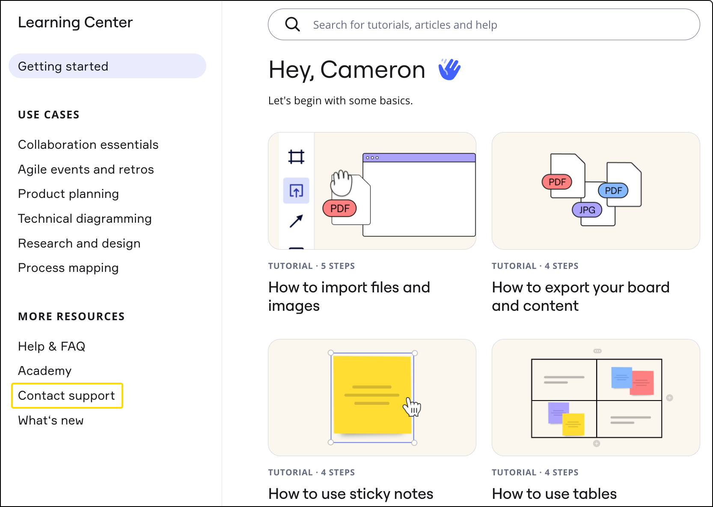

Nosso objetivo é assegurar a melhor experiência com o nosso produto. Fornecemos ferramentas úteis para oferecer suporte a cada usuário da Miro na sua jornada colaborativa. Antes de entrar em contato com o Suporte, tente pesquisar em nossa [Central de ajuda](https://help.miro.com/hc/en-us), [Miro Academy](https://academy.miro.com/), [Blog](https://miro.com/blog/), [Canal do Youtube](https://www.youtube.com/channel/UCfhGfgBKDcFI74bBJ9yjLDQ), e [Webinars da Miro](https://go.miro.com/webinars).

Você também pode visitar a[Comunidade da Miro](https://community.miro.com/?utm_source=zendesk&utm_medium=referral&utm_campaign=contact_support) para fazer perguntas a outros usuários da Miro, compartilhar melhores práticas e discutir soluções, além de acessar[a Lista de Desejos da Comunidade](https://community.miro.com/community-welcome-guide-14/wish-list-everything-you-need-to-know-1099/?utm_source=zendesk&utm_medium=referral&utm_campaign=contact_support) para compartilhar as funcionalidades dos seus sonhos.

### Maneiras de entrar em contato com o suporte para diferentes planos da Miro

:::warning
Observe que o suporte de tickets está incluído somente nos planos Starter, Business e Enterprise. Você pode entrar em contato com o Suporte da Miro por meio de nosso formulário acessível no produto e faremos o nosso melhor para atendê-lo o mais rápido possível, mas observe que, no momento, só garantimos e nos comprometemos com SLA para nossos [clientes do Suporte Premium](https://drive.google.com/file/d/173zCEinS1MPAxlzF-9XLmFF0D-0NS1ix/view?usp=drive_link).
:::

:::note
[Leia este artigo](../../tools/troubleshooting/07-how-to-troubleshoot-and-report-a-bug.md) antes de relatar um bug.
:::

| **Tipo de solicitação** | **Plano Free,**  **Plano Education** | **Plano Starter,** **Plano Business** | **Plano Enterprise** |
| --- | --- | --- | --- |
| **Perguntas relacionadas ao produto** | Visite a [Comunidade da Miro](https://community.miro.com/?utm_source=zendesk&utm_medium=referral&utm_campaign=contact_support) | Visite a [Comunidade da Miro](https://community.miro.com/?utm_source=zendesk&utm_medium=referral&utm_campaign=contact_support)  Enviar uma solicitação de suporte | Visite a [Comunidade da Miro](https://community.miro.com/?utm_source=zendesk&utm_medium=referral&utm_campaign=contact_support)  Enviar uma solicitação de suporte  ✏️ Garantimos um tempo de resposta mais rápido para os clientes do [Suporte Premium](https://drive.google.com/file/d/173zCEinS1MPAxlzF-9XLmFF0D-0NS1ix/view?usp=drive_link) |
| **Perguntas de cobrança** | Visite a [Comunidade da Miro](https://community.miro.com/?utm_source=zendesk&utm_medium=referral&utm_campaign=contact_support) | Entre em contato conosco por meio do endereço de e-mail na sua fatura, ou envie uma solicitação de Suporte | Entre em contato com o time da sua conta |
| **Ideias e solicitações de funcionalidades** | Visite a [Lista de Desejos da Comunidade](https://community.miro.com/community-welcome-guide-14/wish-list-everything-you-need-to-know-1099/?utm_source=zendesk&utm_medium=referral&utm_campaign=contact_support) | | |
| **Preço e segurança do plano Enterprise** | [Contatar Vendas](https://miro.com/contact/sales/?lead_source=Contacts) | | |
| **Informações da empresa, notícias, oportunidades de parceria e ativos de mídia** | [Entre em contato aqui](https://miro.com/contact/general/) | | |
| **Oportunidades de emprego** | [Explore funções abertas](https://miro.com/careers/) | | |

### Como entrar em contato com o Suporte da Miro

> **Disponível para:** planos Starter, Business e Enterprise

Você pode enviar uma solicitação de suporte para qualquer um dos seguintes tópicos:

- Produto da Miro
- Cobrança e assinaturas
- Login e registro
- Segurança e legal
- Ofertas e programas especiais
- Miro para desenvolvedores

#### Pré-requisitos

Certifique-se de que você está conectado a um time pago. Você só pode enviar uma solicitação para o Suporte da Miro como membro de um time pago.

#### Procedimento

Siga estes passos:

1. No painel da Miro, no canto superior direito, selecione seu avatar.
   Seu menu de perfil abre.
2. Selecione **Centro de aprendizagem**.
   O modal do **Centro de aprendizagem** abre.
3. Selecione **Contatar suporte**.
4. Selecione um tópico para sua solicitação.
5. Siga as instruções na tela para escolher subtópicos.
   O formulário de solicitação de suporte abre.
6. (Opcional) Acima do formulário de solicitação, veja os artigos relacionados sugeridos.
7. Complete o formulário de pedido de suporte.
8. Selecione **Enviar**.

   Você enviou com sucesso uma solicitação ao Suporte da Miro.

*Como enviar uma solicitação de suporte*

Para enviar uma solicitação no [aplicativo móvel](../../../getting-started/apps-for-devices/08-mobile-app.md), pressione o ícone do time no canto superior esquerdo > pressione **Ajuda**. Certifique-se de alternar para um time pago se você for membro de vários times.

Você deverá fazer login no seu perfil da Miro antes de enviar uma solicitação de Suporte (se ainda não estiver conectado).

:::warning
Podemos compartilhar detalhes relacionados ao perfil/assinatura somente com os titulares do perfil/assinatura.
:::

:::note
Se você não puder fazer login, use [este formulário](https://miro.com/contact/recover/) para enviar uma solicitação de suporte.
:::
