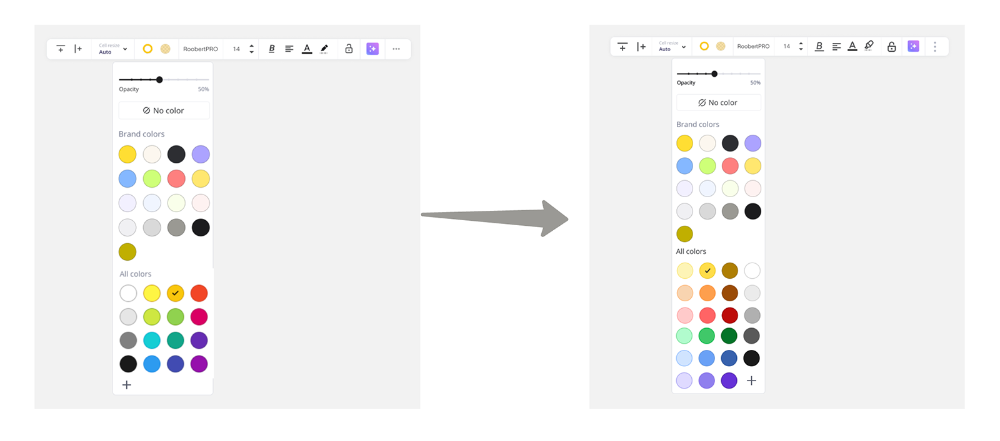
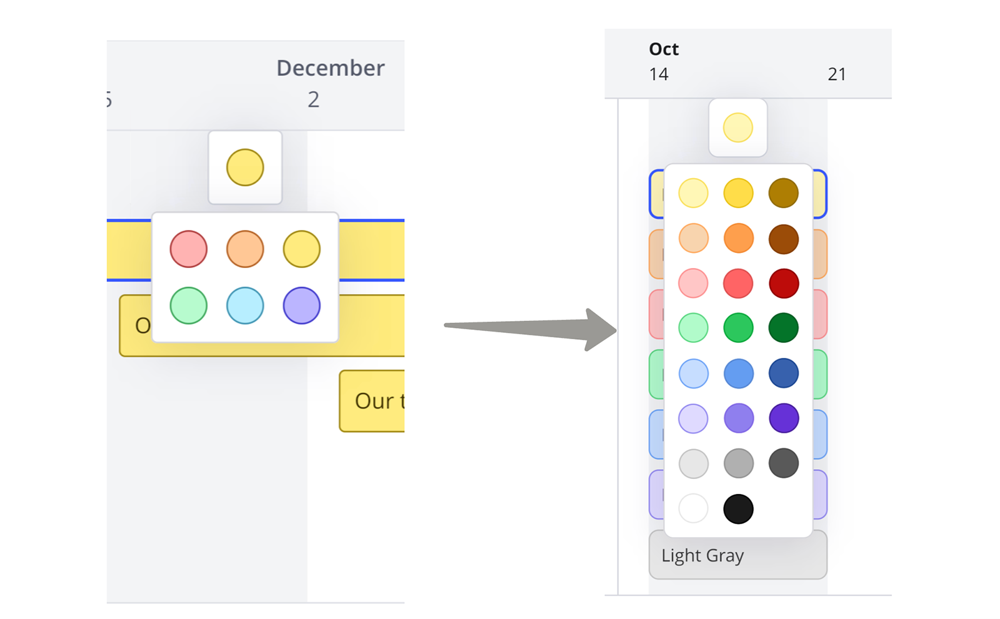
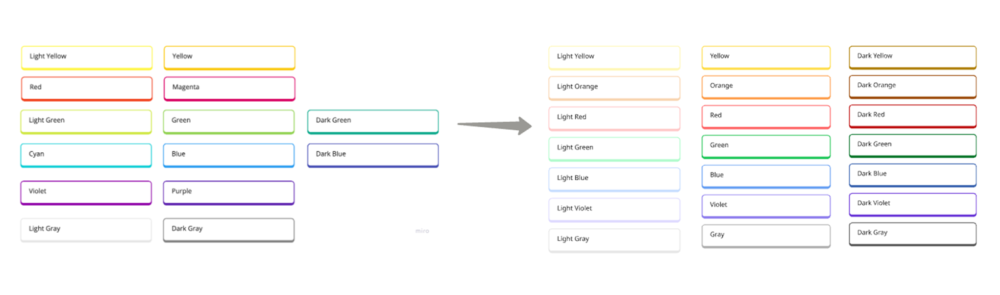
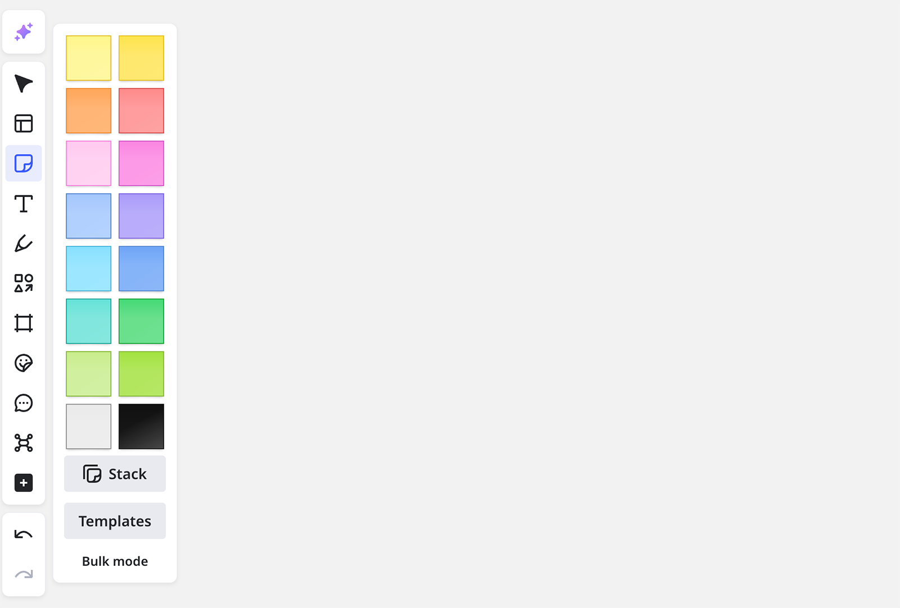
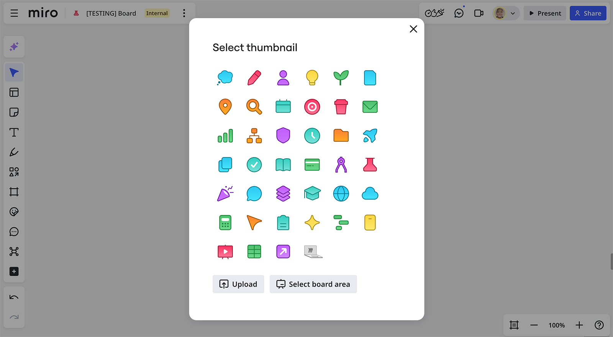
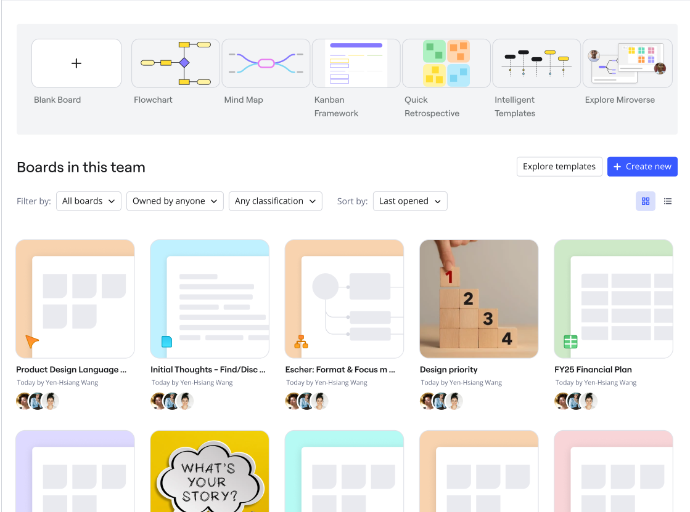
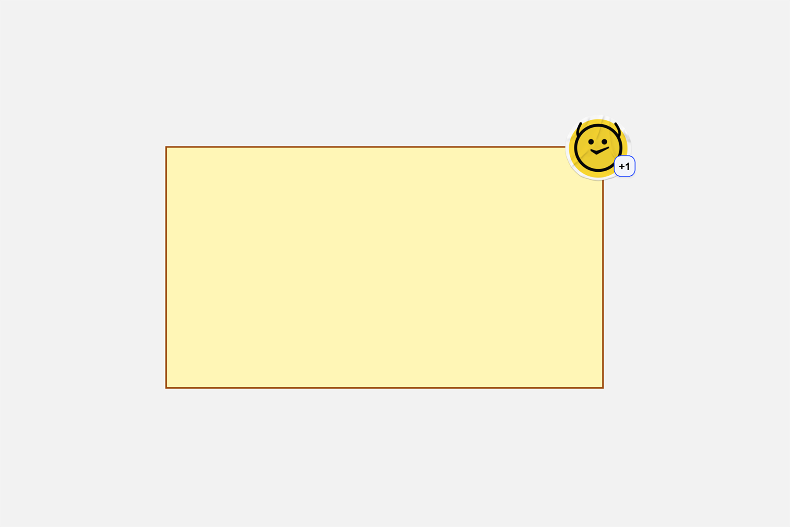
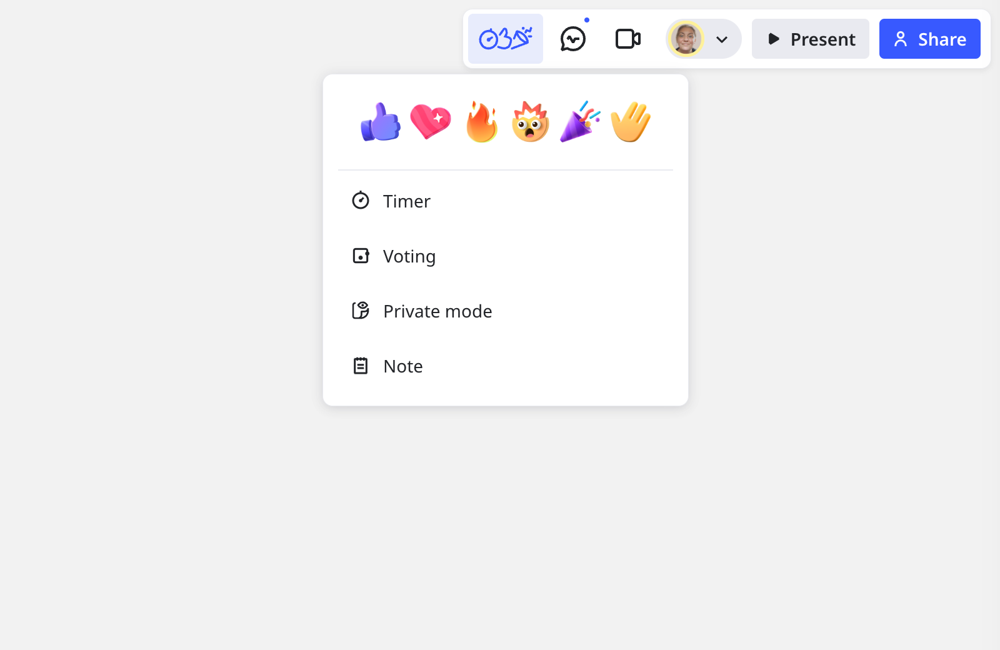
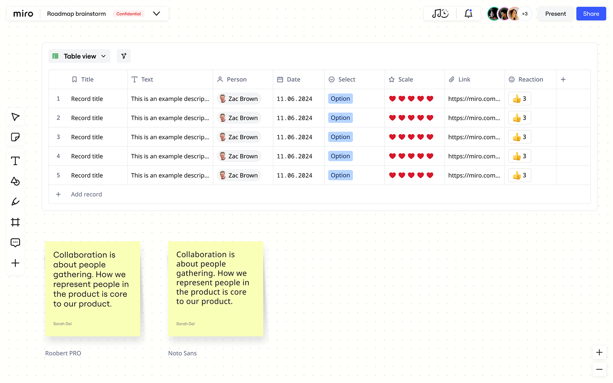

A nova linguagem de design do Miro fornece atualizações importantes para a aparência dos boards que melhoram a acessibilidade e a experiência do usuário .

## Principais funcionalidades

A linguagem de design atualizada do Miro inclui os seguintes recursos principais:

- Uma paleta de cores global expandida com mais tons.
- Design modernizado de notas adesivas.
- Designs de ícones atualizados.
- adesivos interativos e reações atualizadas.

## Seletor de cores global

A paleta de cores global passou por uma reformulação significativa com tons expandidos para cada cor, o que permitirá esquemas de cores mais acessíveis em seus boards. A paleta de cores é mais moderna e fresca, com mais cores disponíveis. As novas cores padrão no seletor de cores global não afetarão nem alterarão o conteúdo do usuário existente.

**Mais informações:** Veja [Cores](14-colors.md).

*Atualizações do seletor de cores global*

Se quiser acessar as cores antigas, você pode usar o seletor de cores para selecionar o tom desejado, e ele será adicionado à sua paleta de cores. Você também pode inserir o código HEX diretamente. Aqui estão os códigos HEX para as cores anteriores:

| Nome da cor |  | Código Hexadecimal |
| --- | --- | --- |
| Branco | branco.png | FFFFFFF |
| Preto | preto.png | 1A1A1A |
| Cinza-claro | cinzaclaro.png | E6E6E6 |
| Cinza | cinza.png | 808080. |
| Amarelo-claro | amarelo-claro.png | FDF445 |
| Amarelo | amarelo.png | FAC70D |
| Verde-claro | verde-claro.png | CEE741 |
| Verde | verde.png | 8FD14F |
| Verde-escuro | verde-escuro.png | 10A689 |
| Ciano | ciano.png | 15CDD4 |
| Azul | azul.png | 2D9BF0 |
| Azul-escuro | azul-escuro.png | 414BB2 |
| Vermelho | vermelho.png | F14725 |
| Magenta | magenta.png | DA0063 |
| Roxo | roxo.png | 652CB3 |
| Violeta | violeta.png | 9610AC |

### Seletor de cores expandido para linha do tempo

A linha do tempo agora pode usar qualquer uma das cores do seletor de cores global, em vez da paleta mais limitada de 6 cores disponível anteriormente.

*Seletor de cores expandido para itens da linha do tempo*

### Seletor de cores expandido para cartões

Os cartões agora estão disponíveis em 21 cores diferentes, com base no seletor de cores global. Anteriormente, apenas 14 cores estavam disponíveis para Cards.

*Seletor de cores expandido para cartões*

## Atualizações de notas adesivas

As cores foram aprimoradas para maior vivacidade e contraste, garantindo melhor visibilidade em fundos de board da Miro . Além disso, o estilo foi renovado com um design mais natural e moderno. A sombra foi ajustada para que as margens das notas adesivas sejam mais fáceis de alinhar.

*notas adesivas atualizadas*

## Miniaturas do board

Escolha entre um novo conjunto de ícones de miniaturas de board padrão para representar o conteúdo do board e tornar mais fácil para os usuários encontrarem o board relevante rapidamente.

*Opções de miniaturas do board atualizadas*

Os planos de fundo das miniaturas agora refletem o formato do arquivo — por exemplo, um plano de fundo azul para documentos e um plano de fundo verde para tabelas — facilitando a identificação rápida do tipo de conteúdo.

*As cores de fundo são baseadas no formato*

## adesivos interativos e reações

A adição de adesivos interativos cria novas maneiras para os usuários interagirem com o conteúdo em um board. Depois que um adesivo é colocado, os usuários podem clicar nele para dar +1 ao adesivo, o que altera o contador e também a aparência do adesivo.

adesivo interativo

As reações também receberam melhorias de design.

*Novo design de reações*

## Fonte

O corpo do texto do aplicativo mudou de Open Sans para Noto Sans para capturar um suporte de idioma mais amplo.

*A fonte do corpo do texto foi alterada para Noto Sans para melhor suporte ao idioma*
