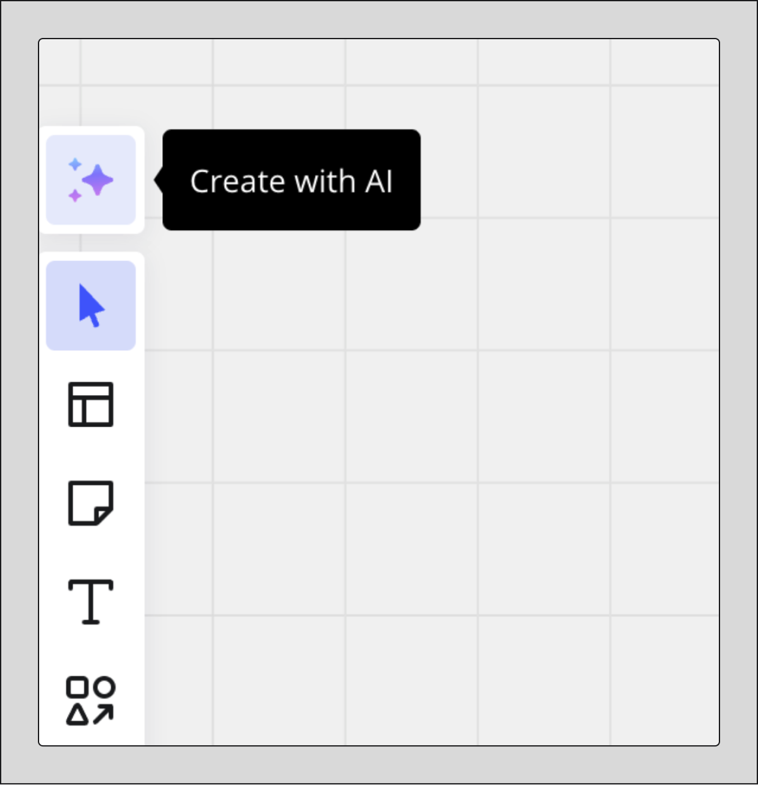
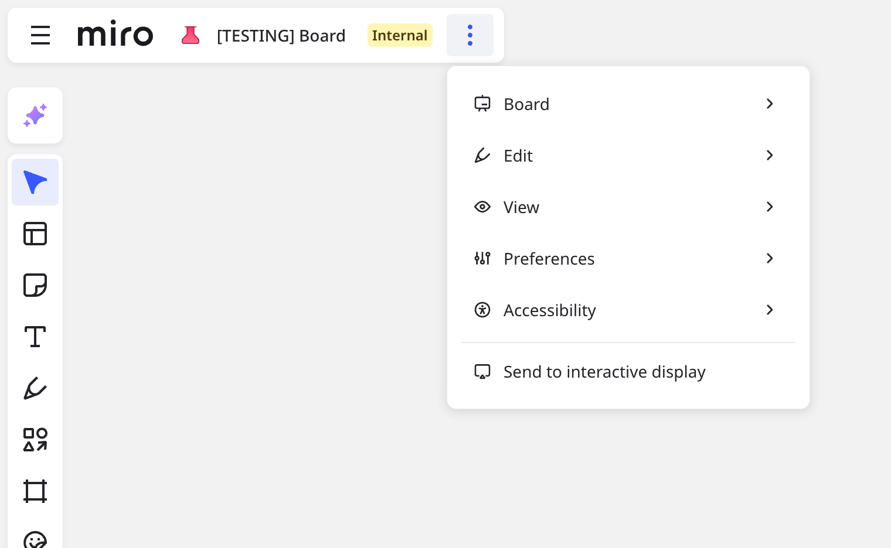

A Miro vem aprimorando a interface do usuário do board para ser mais inclusiva e intuitiva.

<iframe allowfullscreen="" frameborder="0" height="315" src="//fast.wistia.com/embed/iframe/uqbg7sog7l" width="560"></iframe>

Este artigo descreve os pontos de entrada atualizados nas ferramentas de colaboração e criação, opções de boards e controles, além de acesso aos materiais úteis.

## Crie com IA e barra de criação

Para acessar as funcionalidades da Miro AI, selecione **Crie com IA** na parte superior da barra de criação.

*Crie com IA acima da barra de criação*

A barra de criação permite que você acesse as ferramentas essenciais de criação e edição.

Por padrão, as seguintes ferramentas estão fixadas na barra de criação:

- **Selecionar**Seleciona objetos no board
- **Templates**Abre o modal de templates
- **Notas adesivas**Abre o menu de notas adesivas
- **Texto**Habilita o modo de texto
- **Formas e linhas**Abre o menu de formas e linhas
- **Crie desenhos à mão livre**Abre o menu de desenho à mão livre
- **Quadro**Abre o menu de quadros
- **Adesivos, emojis e GIFs**Abre uma galeria de adesivos, emojis e GIFs
- **Comentar**Habilita o modo de comentário
- Ferramentas, mídia e integrações
  Abre as bibliotecas de **Ferramentas** e **Marketplace**

:::note
As funcionalidades Formas e Linhas foram combinadas em uma única ferramenta.
:::

## Barra de controles do canvas

No canto inferior direito do canvas, a barra de controle do canvas inclui as seguintes opções:

- **Quadros e camadas**Permite organizar, apresentar e especificar as configurações de cada quadro ou camada do seu board
- **Zoom e navegação**Ajusta o zoom e também permite que você fixe um mapa do conteúdo no seu board
- **Ajuda e recursos**Abre um menu que inclui acesso a um formulário de feedback, à Central de ajuda da Miro e a outros materiais de aprendizado

:::note
Para fixar ou desafixar o mapa, use a opção de ajuste de tela ou entre no modo de tela inteira. Agora, basta clicar na porcentagem de zoom para acessar um menu secundário.
:::

:::note
A funcionalidade Atividades foi movida para Quadros e camadas.
:::

## Barra de colaboração

A barra de colaboração aparece no canto superior direito do board e inclui opções e ferramentas que ajudam a facilitar e estimular o engajamento.

### Ferramentas de facilitação

O menu de ferramentas de facilitação inclui as seguintes ferramentas:

- **Reações**
  Fornece um conjunto de emojis para que os colaboradores expressem seus sentimentos.
  > ✏️ O menu Reações não inclui mais **Levantar a mão**, e titulares e cotitulares de boards não podem mais habilitar ou desabilitar reações para todos os usuários no menu **Reações**.
- **Cronômetro**Define um limite de tempo para as atividades que são cronometradas
- **Votação**Permite que colaboradores votem em uma decisão e compila os resultados
- **Modo privado**Oculta conteúdo em notas adesivas até ser desabilitado. Você também pode tornar os colaboradores anônimos no board.
- **Nota**Faça anotações e fixe uma **nota visual** no canvas

:::note
As seguintes funcionalidades estão disponíveis no menu **Ferramentas, mídia e integrações**: aplicativos Estimativa e Dependências, videoconferências, chat e quadros para discussão em grupo.

O Talktrack está agora disponível no menu **Apresentar**.
:::

### Atividade

Unificamos os comentários de boards, as gravações do Talktrack e as notificações de times (antes chamada Feed) em uma mesma experiência. Agora você pode ficar por dentro de tudo em um só lugar.

Selecione o ícone do sino para ver as atividades do board, além dos comentários no board e gravações do Talktrack. Para visualizar as notificações de qualquer board do time atual, vá para a guia **Team**.

### Barra de pessoas

A barra **Pessoas** permite que você interaja com colaboradores no board.

Quando os colaboradores estiverem presentes no board, clique na barra suspensa **Pessoas** para expandir a lista de colaboradores e selecione uma das seguintes opções:

- Seguir um colaborador ou trazê-lo para você.
- Pesquisar um colaborador
- Trazer todos os membros do board até você.
- Habilitar ou desabilitar cursores.

### Menu de perfil

Selecione seu avatar para abrir o menu de perfil, que mostra seu nome e função. Você também pode acessar as **configurações de perfil**.

:::note
Para usar **Trazer todos para mim** e **Trazer para mim**, use a lista de colaboradores na barra **Pessoas**.
:::

### Apresentar

O menu **Apresentar** permite que você apresente quadros no seu board como slides. Você também pode criar uma gravação do Talktrack.

:::note
**Apresentar todo o board** e **Apresentar atividades** foram removidos.
:::

### Compartilhar

O **menu Compartilhar** permite que você copie um link para o seu board, convide colaboradores para seu board, incorpore seu board e salve ou publique seu board como um template.

Você também pode acessar as **configurações de compartilhamento**.

## Barra Board

A barra Board permite alterar o nome do board com um clique, e ainda disponibiliza uma seleção atualizada de miniaturas de boards para você escolher. Se você tiver os privilégios adequados, também poderá alterar a classificação do board.

A barra do board inclui o **menu principal**, que você pode acessar selecionando os três pontos verticais.

 *Acesse o menu principal pela barra Board*

:::note
As opções Exportar, Pesquisar board e Marcar o board como favorito agora estão incluídas no **menu principal**.
:::

Confira a lista completa de opções no **menu principal**:

- **Board**
  - Fazer uma cópia
  - Exportar, salvar como template ou inserir.
  - Mover para outro Espaço
  - Marcar o board como favorito
  - Excluir
  - Alterar a cor de fundo.
  - Definir a visualização inicial para membros recém-convidados.
  - Ver o histórico do board.
  - Ver os detalhes do board
- **Editar**
  - Desfazer/refazer
  - Acessar **Paleta de comando**
  - Encontrar o conteúdo do board.
- **Visualizar**
  - Especificar as opções de grade, incluindo desabilitar grade.
  - Entrar no modo de tela inteira.
  - Mostrar ou ocultar cursores de colaboradores, comentários, barras de rolagem, dimensões de objetos e controles para refazer e desfazer.
- **Preferências**
  - Habilitar o controle do mouse ou trackpad.
  - Especificar se deseja alinhar objetos no board
  - Habilitar **Seguir todas as conversas**
  - Acessar suas configurações de perfil.
- **Acessibilidade**
  - Habilitar **Seleção precisa**
  - Habilitar **Reduzir movimento**
  - Verificar a acessibilidade.
