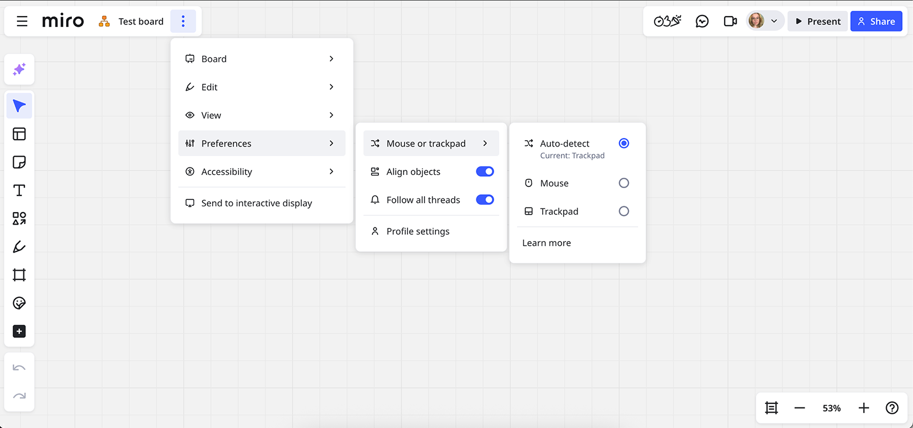
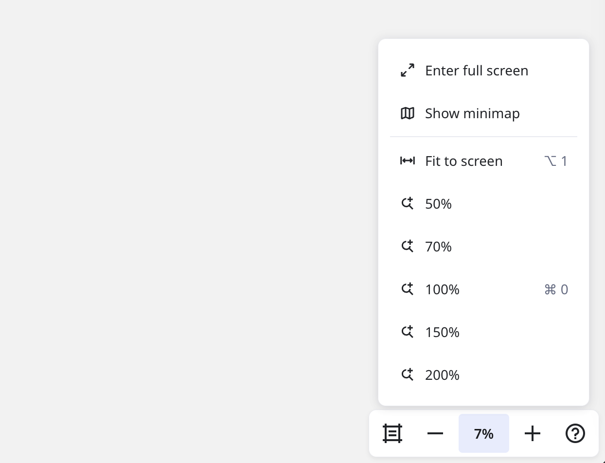

Você pode trabalhar na Miro com um **mouse**, **trackpad** ou **tela sensível ao toque**.

Se você usar um mouse:

- Para mover ao redor do board, pressione o botão direito do mouse e arraste
- Para ampliar, role a roda do mouse
- Para criar o campo de seleção, altere para a ferramenta Selecionar, clique e arraste o canvas

Se você usar o trackpad:

- Deslize dois dedos para mover ao redor do board
- Pince para dar zoom
- Para selecionar objetos, altere para a ferramenta de seleção, pressione e arraste o canvas

Se você usar a tela sensível ao toque:

- Arraste o canvas para mover
- Pince para dar zoom
- Pressione por um tempo e arraste para selecionar objetos

Para visualizar as dicas, clique no **Menu principal** ícone de três traços > **Preferências** > **Mouse ou Trackpad** > **Saiba mais**.

**Alteração automática** é definida por padrão, mas você pode alterá-la para **Mouse** ou **Trackpad**. O modelo de navegação é definido para cada usuário individualmente e se aplica a todas as guias do navegador atual.

- Selecione **Mouse** se você trabalhar com o mouse mágico da Apple. Se você escolher **Mouse** e usar o trackpad, o deslizamento com dois dedos fará o zoom
- Selecione **Trackpad** se você usar o trackpad em conjunto com um mouse ou tablet gráfico. O modo de trackpad é mais conveniente quando você está acostumado a rolar para baixo com uma roda e dar zoom com a roda do mouse + **Ctrl** (*para Windows*)/**Cmd** (*para Mac*)

*Alternando entre mouse e trackpad nos controles de navegação*

Você também pode abrir os controles clicando com o botão direito do mouse em qualquer lugar do board e escolhendo **Mouse ou trackpad.**

Os eventos de toque são distinguidos automaticamente dos eventos do mouse ou do trackpad, para que você não precise definir um modo de navegação específico para o seu dispositivo de tela sensível ao toque.

### Como alterar entre a ferramenta de seleção e de panorâmica

Para se deslocar ao redor do seu board, certifique-se de alterar para o modo manual. Para selecionar um objeto, ative o modo de seleção. Você pode alternar entre os dois modos habilitando/desabilitando a ferramenta de seleção na barra de ferramentas (veja abaixo) ou usando [as teclas de atalho](21-work-smarter-not-harder.md#como-alternar-entre-os-modos-de-selecao-e-panoramica) **V** e **H.**

*Como alternar entre a ferramenta de panorâmica e de seleção*

A ferramenta de seleção não está disponível para visualizadores/comentaristas que não são autorizados na Miro ou não têm permissão para copiar os objetos do board nas [configurações de conteúdo do board](../sharing-boards/14-how-to-allow-or-restrict-copying-and-exporting-boards-and-content.md).

Se você usar um mouse, também pode mover ao redor do board

- enquanto mantém o botão direito do mouse pressionado
- com o botão esquerdo mouse do enquanto mantém a barra de espaço pressionada
- Com o botão esquerdo do mouse enquanto mantém a roda do mouse pressionada (disponível apenas para alguns mouses)

### Navegação no board

Encontre os controles de navegação no canto inferior direito do seu board. Os controles permitem que você altere o nível de zoom, faça o conteúdo do board se ajustar à tela, abra e navegue no minimapa (que também pode ser mostrado ou ocultado via a tecla de atalho **M**), entre e saia do modo de tela inteira.

*Barra de ferramentas de navegação do board*

## Perguntas frequentes

**Não vejo o modo de tela sensível ao toque nas configurações de navegação. Posso usar a Miro na tela sensível ao toque?**

Sim, você pode usar a Miro em todos os dispositivos de tela sensível ao toque. A Miro detecta automaticamente os eventos de toque e os distingue dos eventos de mouse/trackpad. A tela sensível ao toque sempre funciona como descrito acima, independentemente do mouse ou do trackpad selecionados nas configurações.

**A Miro é compatível com tablets gráficos?**

A Miro pode ser usada com tablets gráficos, mas não fornecemos um modo de navegação especial para eles. Uma caneta gráfica para tablet é aceita como um mouse e funciona no nível básico sem oferecer suporte a funcionalidades específicas.

**Meu trackpad está congelado, o que está me impedindo de ampliar ou reduzir o zoom dos boards da Miro. Como faço para corrigir isso?**

Para Mac, clique no menu da Apple no canto superior esquerdo da tela > **Configurações do sistema** > **Trackpad** > **Rolar e Zoom** e alterne entre desligado e ligado novamente o **Zoom para aproximar ou distanciar**. Para Windows, abra o menu no canto inferior esquerdo da tela > **Configurações** > **Dispositivos** > **Touchpad** > alterne **Touchpad** entre desligado e ligado novamente.

**Quando tento mover o board de forma panorâmica, movo os objetos do board. Como faço para corrigir isso?**

Clique com o botão direito do mouse e arraste para se mover pelo board.
