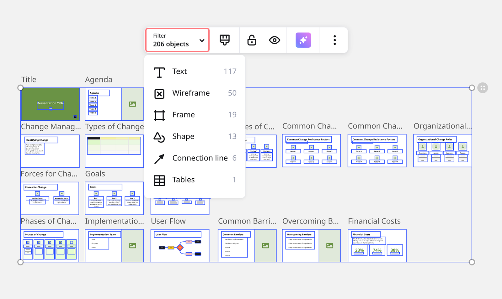
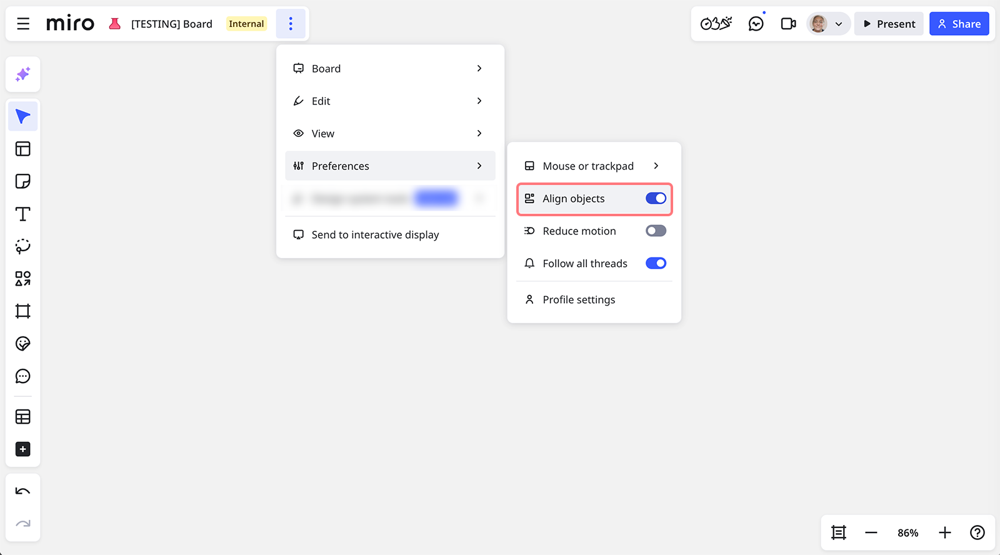
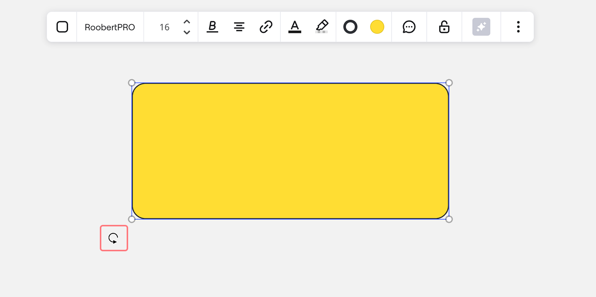

## Selecionar vários objetos

Verifique se você ativou a [ferramenta Selecionar](21-work-smarter-not-harder.md#como-alternar-entre-os-modos-de-selecao-e-panoramica) (ou pressione **V** para ativá-la) e arraste o campo de seleção sobre os objetos necessários. Isso selecionará todos os objetos tocados pela seleção (excluindo [USM](../advanced-tools/07-user-story-mapping.md), [Kanban](../advanced-tools/02-columns-formerly-kanban.md), [mapa mental](../advanced-tools/03-mind-map.md) e [tabelas](../advanced-tools/05-grid.md). Para selecionar esses objetos, cubra pelo menos 90% do campo de seleção). Se você trabalha no [aplicativo para mobile](../../getting-started/apps-for-devices/08-mobile-app.md) ou [aplicativo para tablet](../../getting-started/apps-for-devices/11-tablet-app.md) ou usa uma tela sensível ao toque, faça um **toque longo** e arraste.

Você também pode usar a funcionalidade de filtro de objetos para selecionar tipos específicos de objetos para mover. Clique e arraste para selecionar todos os objetos, depois clique em **Filtro** no menu de contexto e selecione um tipo de objeto. O campo de seleção será ajustado e será possível mover apenas os objetos que você filtrou.

*Filtrar por tipo de objeto*

Para iniciar uma seleção *precisa* que inclua apenas um objeto se ele cobrir mais de 90% de sua superfície, clique ou mantenha pressionado e arraste. Isso é útil se você precisar selecionar objetos sobre outra forma de plano de fundo.

Se você trabalhar com um teclado, também é possível selecionar objetos específicos clicando neles, um por um, enquanto mantém pressionada a tecla **Shift** ou **Ctrl** *(para Windows) /* **Command** *(para Mac).*

### Seleção precisa

A seleção precisa permite que você selecione objetos apenas quando cobrir mais de 90% de sua superfície.

Para utilizar a seleção precisa, certifique-se de que está usando a ferramenta Selecionar. Em seguida, clique ou mantenha pressionado o botão do mouse. Agora você pode arrastar a ferramenta Selecionar usando a seleção precisa.

## Como usar a ferramenta Laço para selecionar vários objetos

Outra maneira de selecionar objetos é usar a ferramenta Laço. Para incluir um objeto na seleção, você precisa incluir pelo menos 90% dele na área de seleção.

:::tip
Selecione todos os elementos no board usando o **Ctrl+A** / **Cmd+A** [atalho](06-shortcuts-and-hotkeys.md).
:::

## Como modificar os objetos selecionados

Os objetos selecionados podem ser movidos e redimensionados juntos. Você pode [align](08-structuring-board-content.md), [agrupar](08-structuring-board-content.md), [bloquear](17-locking-content-on-the-board.md) e filtrar os objetos (ver abaixo) ou usar outras opções no menu.

:::note
Certifique-se de que nenhum dos objetos que você deseja selecionar está [bloqueado](17-locking-content-on-the-board.md). Caso contrário, você precisará desbloqueá-los primeiro clicando no objeto e escolhendo **Desbloquear**.
:::

:::warning
Não é possível agrupar objetos em [tabelas](../advanced-tools/05-grid.md) ou objetos localizados em [quadros](../essential-tools/07-frames.md) diferentes.
:::

:::warning
[Os visitantes](../sharing-boards/08-collaboration-with-visitors.md) não podem bloquear nem desbloquear objetos no board. Se o [bloqueio protegido](17-locking-content-on-the-board.md) estiver ativado em um objeto, apenas o titular do board/[cotitular](../sharing-boards/06-co-owners-of-boards-and-spaces.md) pode desbloqueá-lo.
:::

:::tip
Outra maneira de mover objetos juntos é colocá-los em um quadro único e mover o quadro. [Saiba mais](../essential-tools/07-frames.md) sobre quadros na Miro.
:::

Duplicação inteligente

Acelere o seu trabalho usando o atalho **Ctrl + D** para duplicar objetos no board de forma rápida e fácil.

:::note
Você também pode usar **Alt + setas** para duplicar um objeto vertical ou horizontalmente.
:::

## Bloquear um objeto

Evite que objetos sejam movidos, editados ou excluídos acidentalmente bloqueando-os. Use o bloqueio protegido para evitar que outros usuários alterem o seu conteúdo. Saiba mais no artigo: [Como bloquear conteúdo no board](17-locking-content-on-the-board.md).

## Alinhar objetos

A ativação desta opção criará guias de alinhamento para quaisquer objetos que você mover, ajudando a garantir uma aparência limpa e bem equilibrada para os objetos do seu board.

Você pode ativar/desativar a funcionalidade no menu principal. Clique nos **três pontos** (**...**) > **Preferências** > **Alinhar objetos.**

*A opção para ativar Alinhar objetos nas configurações do board*

## Organização de objetos

Organize os objetos no seu board. Essa funcionalidade ajuda a estilizar boards e diagramas com precisão, especialmente com uma grande quantidade de conteúdo sobreposto.

1. Selecione o objeto.
2. No menu de contexto, clique nos três pontos (**...**) para abrir o menu **mais**.
3. Escolha uma das seguintes opções:

- **Trazer para a frente:** Mover um objeto para a frente de todos os objetos.
- **Enviar para trás:** Mover um objeto para trás de todos os objetos.
- **Avançar:** Mover um objeto à frente do objeto diretamente à frente do objeto selecionado.
- **Recuar:** Mover um objeto para trás do objeto diretamente atrás do objeto selecionado.

:::note
Esta funcionalidade não está disponível para quadros. Os quadros são sempre posicionados atrás dos objetos do board.
:::

## Girar objetos

Gire facilmente os objetos no board para ajustar o seu conteúdo. Encontre o ícone de girar no canto inferior esquerdo do objeto, clique e arraste-o para alterar a posição.

*Girando um objeto*

## Limpeza de Conteúdo

Você pode limpar o conteúdo de vários widgets (como notas adesivas, formas e cartões) simultaneamente. Esta funcionalidade permite que você remova todo o texto, tags, emojis, autores, responsáveis e datas de vencimento dos widgets selecionados, revertendo-os ao seu estado original enquanto mantém seu estilo (cores, tamanhos, etc.).

Para limpar o conteúdo:

1. Selecione os widgets que você deseja limpar.
2. Clique com o botão direito para abrir o menu de contexto.
3. Selecione "Limpar conteúdo" no menu.
4. Como alternativa, use o atalho Cmd + Backspace (Mac) ou Ctrl + Backspace (Windows).

Limpar conteúdo não funciona em outros widgets (por exemplo, Texto, widgets de tabela) e não funciona em cartões Jira ou Azure. Se um usuário selecionar várias notas adesivas, formas e cartões, o conteúdo será excluído em todos os widgets, exceto nos cartões Jira/Azure.

## Perguntas frequentes

1. *Não consigo arrastar o campo de seleção. O que eu faço?*  - Certifique-se de alternar para a [ferramenta de seleção](21-work-smarter-not-harder.md#como-alternar-entre-os-modos-de-selecao-e-panoramica).
2. *Não consigo agrupar objetos selecionados. Por quê?*  - Observe que não é possível agrupar objetos dentro de [tabelas](../advanced-tools/05-grid.md) e objetos localizados em [quadros.](../essential-tools/07-frames.md)
3. *Posso selecionar e mover objetos individuais dentro de um grupo?*  - Sim, clique duas vezes em um objeto e arraste-o. Veja como você faz isso  [nesta página](08-structuring-board-content.md)  .
