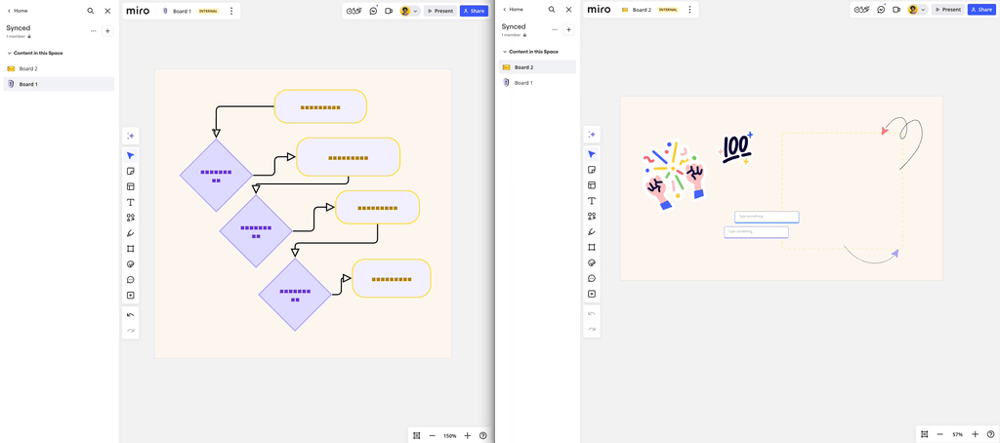
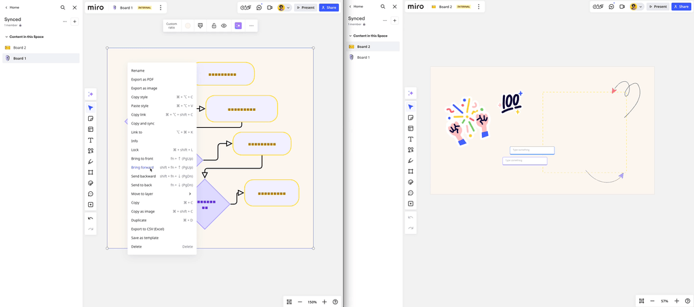
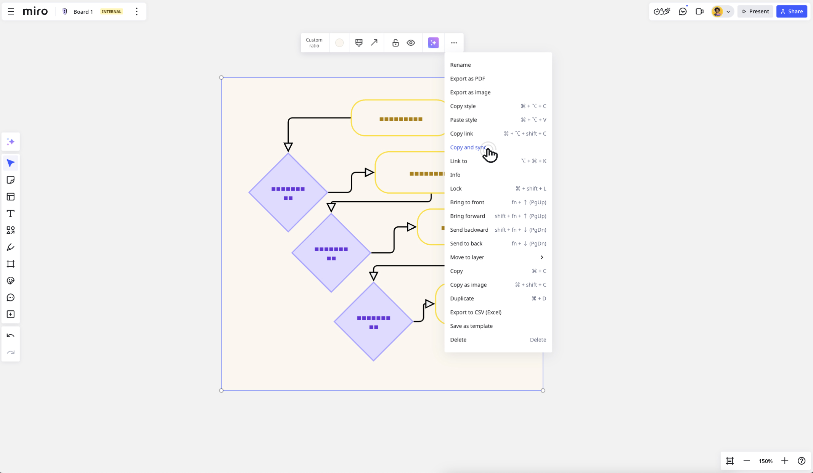
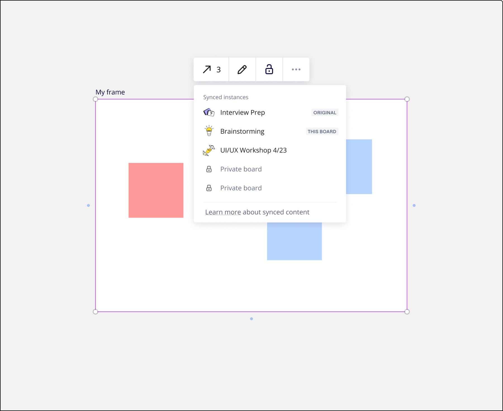
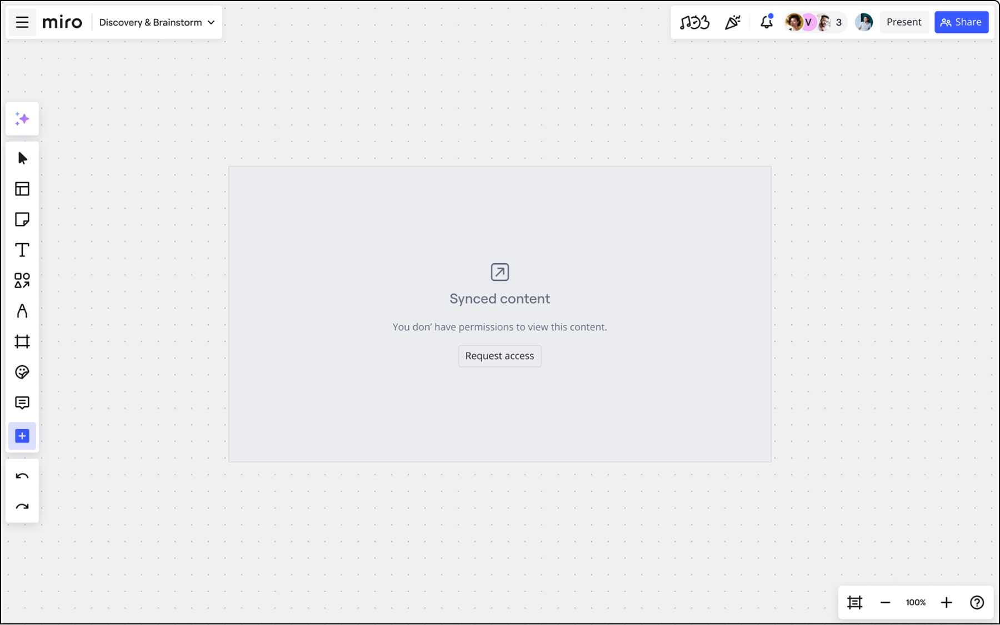

Sincronize e visualize os conteúdos entre os boards para que fiquem sempre atualizados.

> **Disponível para:** planos Business e Enterprise

## Principais funcionalidades

- **Conexão perfeita:**  insira widgets dinâmicos, como quadros, documentos ou diagramas, diretamente em vários boards e documentos. Garanta consistência com atualizações em tempo real.
- **Maior eficiência:** economize tempo reutilizando o conteúdo em várias plataformas para poder se concentrar na colaboração e na criatividade sem ter que repetir tarefas.

*Um exemplo de conteúdo sincronizado em um board*

## Como criar uma cópia sincronizada

### Copiar/colar entre os boards

Para sincronizar o conteúdo entre os boards, copie um widget de um board, cole-o em outro e confirme **Substituir por cópia sincronizada**.

*Copiar e colar entre os boards*

### Por meio do menu de contexto do widget

Para criar uma cópia sincronizada:

1. Selecione um único widget.
2. Abra o menu de três pontos (**...**) e selecione **Copiar e sincronizar**.
3. Navegue até o board de destino e cole (**cmd/ctrl + V**).

Esta opção também permite criar cópias sincronizadas do mesmo board.

## Editar widgets sincronizados

:::warning
As cópias sincronizadas estão disponíveis no modo somente leitura para todos os usuários. Para alterar o conteúdo da cópia, os usuários devem modificar o conteúdo original.
:::

A cópia sincronizada é um widget independente no board.

Os usuários com acesso de edição podem alterar a posição, ajustar o tamanho, adicioná-la a quadros ou Documentos e agrupá-la com outros widgets.

Os comentários feitos em uma cópia sincronizada ficam visíveis somente nessa cópia específica e não aparecem no widget original nem em nenhuma outra cópia sincronizada.

## Navegação e gerenciamento de cópias

O menu de contexto do widget original e de suas cópias sincronizadas contêm uma lista de cópias. Isso permite navegar entre as cópias e abrir o widget original para editar o conteúdo.

Para acessar a cópia/widget original:

1. Clique em um widget sincronizado para selecioná-lo.
2. No menu de contexto, clique no **ícone de seta** para abrir a lista.
3. Clique em qualquer item para abrir um board em uma guia separada ou acessar o widget no mesmo board.

## Permissões

A criação de cópias sincronizadas está disponível para usuários com um perfil da Miro e visitantes com acesso de edição. Caso tenha acesso somente de visualização ou comentário, você deve criar uma conta na Miro e obter permissões de edição para criar cópias sincronizadas.

:::warning
Caso um usuário não tenha acesso ao board com o widget original, ele não conseguirá ver o widget sincronizado em nenhum outro lugar.
:::

Certifique-se de conceder permissão aos usuários certos para que possam ver o conteúdo original.

## Perguntas frequentes

**Adicionei um widget sincronizado a outra página, mas ninguém mais consegue vê-lo.**

A pessoa com quem você compartilha o board deve ter acesso ao widget original para ver as cópias sincronizadas.

**Como sei se é uma cópia sincronizada ou cópia original?**

Os widgets sincronizados são diferenciados por uma borda de seleção roxa. Ao editar o widget original, as outras instâncias serão alteradas em um intervalo de 10 segundos.

**Posso fornecer acesso ao conteúdo sincronizado sem conceder acesso ao board original?**

Atualmente, as permissões originais do board são usadas para verificar se o usuário pode visualizar o conteúdo sincronizado.

**E se eu excluir o conteúdo original?**

Todas as cópias sincronizadas são mantidas, mas os usuários verão a mensagem "O conteúdo original foi excluído".

**Como posso ter certeza de que o conteúdo sincronizado está atualizado?**

Por padrão, as alterações no conteúdo original são automaticamente aplicadas às cópias em até 10 segundos, sem que o usuário precise realizar outras ações. Caso contrário, o usuário verá a mensagem de erro em vez do conteúdo desatualizado.
