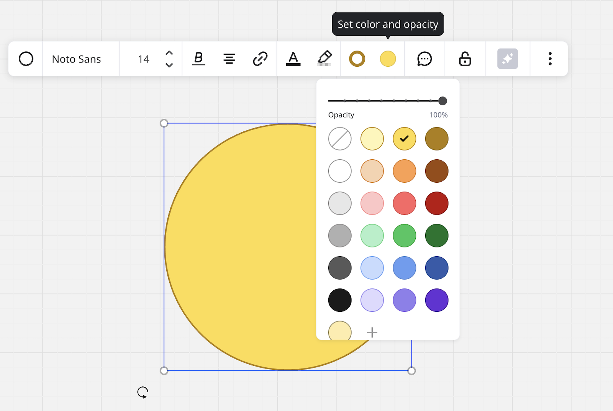
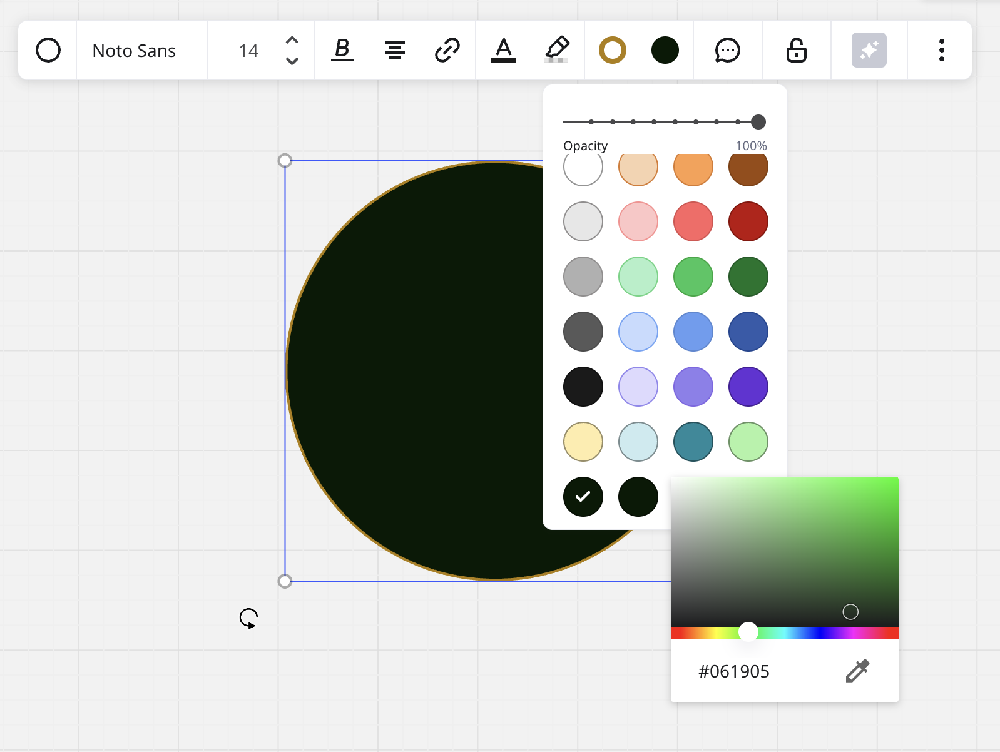

Há 23 cores padrão na paleta. Você pode aplicá-las a qualquer [desenho](../essential-tools/10-pen.md), [formato](../essential-tools/11-shapes.md), [linha de conexão](../essential-tools/05-connection-lines.md), [quadro](../essential-tools/07-frames.md), [tabela](../advanced-tools/05-grid.md), [cartão](../essential-tools/02-cards.md) ou [texto](../essential-tools/16-text.md). A paleta é a mesma em todas essas ferramentas e torna muito mais fácil criar conteúdos visualmente agradáveis.

:::warning
A paleta de cores [das notas adesivas](../essential-tools/14-sticky-notes.md) é separada e limitada a 16 cores.
:::

*A paleta de cores padrão*

### Como adicionar novas cores

:::tip
Simplifique a criação de conteúdo da time enviando cores para o seu [centro de marca](../../administration/get-started-as-a-miro-admin/04-brand-center.md)e aplique seu próprio [estilo de marca](../../administration/get-started-as-a-miro-admin/04-brand-center.md) aos boards.
:::

Para adicionar uma nova cor:

1. Selecione seu objeto.
2. Abra a paleta de cores.
3. Clique no ícone **+** .
   O espectro de cores será aberto.
4. Selecione a cor que você gostaria de adicionar. Há três métodos para fazer isso, descritos abaixo.

*A ferramenta de espectro de cores para adicionar novas cores*

Ao adicionar uma nova cor, ela é acrescentada à paleta de cores de todas as ferramentas e a alteração é aplicada ao seu perfil.

Observe que a paleta de cores das [notas adesivas](../essential-tools/14-sticky-notes.md) não é personalizável.

Há três maneiras de adicionar uma nova cor à sua paleta:

Do espectro de cores:

1. Mova o controle deslizante ou clique no local do espectro.
2. Em seguida, clique na canvas para salvar a cor.

Ao inserir o código Hex:

1. Digite o código de cor hexadecimal no campo na parte inferior do espectro de cores.
2. Pressione **Enter**.

Usando o seletor de cores:

1. Clique no ícone do conta-gotas.
2. Clique ou arraste em qualquer lugar do seu board para escolher a cor.

A paleta personalizada é aplicável a todos os boards do seu perfil.

Se você alterar a cor de uma [forma](../essential-tools/11-shapes.md)/[nota adesiva](../essential-tools/14-sticky-notes.md)/[cartão](../essential-tools/02-cards.md) e adicionar um deles ao board, a cor dos objetos adicionados será igual à cor usada anteriormente até que você recarregue o board.

### Como remover cores

Se quiser eliminar as cores não utilizadas da paleta, basta clicar nelas e arrastá-las para fora da paleta. Observe que as cores padrão não podem ser removidas.

### Perguntas frequentes

**Posso alterar a cor de fundo do board?**

Sim. Leia mais sobre [como alterar a cor de fundo](12-board-background-color.md).

**Posso alterar a cor de vários objetos de uma só vez?**

Sim, saiba como selecionar e alterar vários objetos [neste artigo](10-working-with-objects.md).
